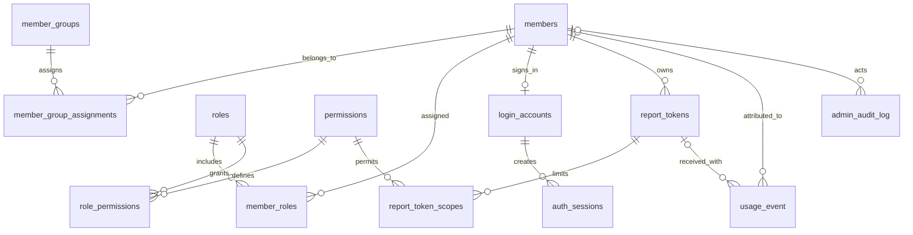

# 服务端数据库重设计（Portal v5）

日期：2026-09-26。

**部署方向已确认：MySQL 用于正式服务端，SQLite 保留用于本地部署及端到端测试。**

本文记录 Portal 的设计及当前实现（**当前 schema 为 v7；v4 是冻结基线**：v3 库先迁到 v4，再依次走 v4→v5、v5→v6、v6→v7），并作为分阶段验收的标准。**生产代码已接入数据库身份、账号、会话和管理接口**；旧凭证文件只用于显式离线导入。数据库基础层和应用 HTTP 已在隔离 SQLite/MySQL 上执行验证，原有真实业务库未自动迁移。已执行项目的证据见 [2026-09-26 真实端到端报告](真实端到端验收-2026-09-26.md)；真实浏览器交互尚在验收。建表验证、应用接入、存量迁移演练、浏览器及真实客户端验收分开记录，不能相互替代，也不据此宣布全部完成。

设计原型的 SQLite 3.53.2 / MySQL 8.4.9 共 113 项检查通过；此后已实现并验证显式迁移、固定事务连接、历史指纹核对、稳定人员统计及数据库身份运行时。独立 OS 进程的真实 HTTP 验证覆盖 Bun/Node × SQLite/MySQL，四种组合各 41 项通过。详细范围、数量和限制见 [验证记录](database-v4/验证记录.md)。

## 1. 这次要解决什么

人员、分组、角色、权限、登录账号、上报凭证、登录会话和管理操作记录统一进入服务端数据库。数据库成为服务端身份与权限的唯一真值；`credentials.json` 退为一次性导入源。

此次改造针对旧实现的三个耦合：

| 现状 | 实际后果 | 新设计 |
|---|---|---|
| `usage_event.user_id` 实际写入姓名 | 改名后历史分成两人；同名复用可能合并不同人员 | 新增稳定的 `member_id`，显示名单独存储 |
| 人员管理按 Token 定位人员 | 轮换凭证等于更换管理对象的标识 | 所有人员操作按 `member_id`；凭证按 `token_id` |
| 登录会话在内存中保存上报 Token 与密码哈希 | 重启需要重新登录，轮换上报 Token 会连带退出后台 | 账号、会话、上报 Token 独立关联人员 |

源码定位和接口改造清单见 [接口与验收方案](数据库重设计-接口与验收.md)。

## 2. 数据边界

| 数据 | 存储位置 | 原因 |
|---|---|---|
| 服务端人员、分组、角色及权限 | 服务端数据库 | 所有实例共享同一份权限事实 |
| 登录账号、密码哈希、Token 摘要 | 服务端数据库 | 管理操作提交即生效，可备份和审计 |
| 登录会话、验证码挑战、限流桶 | 服务端数据库，带过期时间 | 支持服务重启和多个服务实例，验证码仍一次性使用 |
| 上报事件及历史归属 | 同一个服务端数据库 | 不再出现身份和用量各自使用不同持久化目标 |
| 客户端 `identity.json` / `connection.json` | 员工本机 | 保存已主动署名的客户端连接凭证；断网使用不能依赖远端 MySQL |
| 本机 `usage.sqlite`、扫描水位、pending/outbox | 员工本机 | 保留现有扫描、离线、重试机制 |
| MySQL 连接密码、验证码 HMAC 密钥等部署秘密 | 环境变量或部署秘密管理 | 不把“连接数据库所需的秘密”再放进数据库 |

配置了 MySQL 后连接失败必须报错，不允许悄悄转写 SQLite。服务端数据库不能与本地 `usage.sqlite` 共用，也不能使用本地派生库的自动重建逻辑。

## 3. 核心关系


```mermaid
erDiagram
    members ||--o{ member_group_assignments : belongs_to
    member_groups ||--o{ member_group_assignments : assigns
    members ||--o{ member_roles : assigned
    roles ||--o{ member_roles : includes
    roles ||--o{ role_permissions : grants
    permissions ||--o{ role_permissions : defines
    members ||--o| login_accounts : signs_in
    login_accounts ||--o{ auth_sessions : creates
    members ||--o{ report_tokens : owns
    report_tokens ||--o{ report_token_scopes : limits
    permissions ||--o{ report_token_scopes : permits
    members o|--o{ usage_event : attributed_to
    report_tokens o|--o{ usage_event : received_with
    members o|--o{ admin_audit_log : acts
```

`member_id` 是服务端生成的 UUID，创建后不变。姓名、用户名、角色、分组及 Token 都不是人员主键。
人员与分组是**多对多**（`member_group_assignments(member_id, group_id, created_at_ms)`），
所以完全没有「当前分组」这个单值列。

姓名输入继续复用现有 `validateName()`：最多 32 个 UTF-16 码元，分组名最多 64 个。数据库列的容量约束不能替代这条应用契约；不能创建旧插件收到后无法保存的超长服务端身份，也不能截断姓名来通过客户端校验。

第一阶段仍提供管理员和普通成员两个内置角色，不同时引入自定义权限编辑器、多租户、复杂组织树或审批流。表结构允许人员具有多个角色；现有页面的两个角色入口由服务端角色目录驱动。

## 4. 表结构

完整列定义、约束和索引：**当前 v9 的 SQL 真源**在 `packages/core/src/db/portal-schema-v5.ts`
（v5 的 19 张表 + v6 的 `provider_alias` + v7 的 `model_price` 增量，可打包的 SQLite / MySQL 两份语句），
`packages/core/src/db/portal-schema-v8.ts` 是 v8 的看板汇总表增量（`usage_rollup_day` /
`usage_rollup_hour` / `usage_rollup_hod` / `usage_rollup_meta`），
`packages/core/src/db/portal-schema-v9.ts` 是 v9 的**加列**增量（`usage_event.source`）；
`docs/database-v5/schema.mysql.sql` 与 `docs/database-v5/schema.sqlite.sql` 是 **v5 冻结基线**，
`docs/database-v4/schema.mysql.sql` 与 `docs/database-v4/schema.sqlite.sql` 是更早的 **v4 冻结基线**
（迁移账本按 SQL 文本摘要识别版本，所以这些 SQL 都不允许再改）——
**v6 / v7 / v8 / v9 的增量只存在于代码里，没有对应的冻结 SQL 文件**（各自只建表或只加一列，抄一份 SQL 只会多一处会漂移的真源）。
⚠️ 两个增量常量（`PORTAL_*_V6_ADDITIONS` / `PORTAL_*_V7_ADDITIONS`）与 v5 正文**一个字都不许再改**：
账本校验和是对它们的**当前全文**求摘要，改动会让现网同版本库全部落到 `unsupported`（拒绝启动）。
新增结构只能再往上加一个版本号 —— v7 / v8 / v9 都是这么加的，并且**冻结**了
`portalSchemaChecksumV6/V7/V8()`，好让已经迁到 v6 / v7 / v8 的库仍被认成「可迁移起点」而不是坏库。
🚨 v9 是唯一一次给**既有表**加列，所以它的列定义**不能写进 v5 常量**：
受控定义里的 `usage_event` 由 `portalV9UsageEventStatement()` **拼接**得到（插入点由 SQLite 的
`ALTER … ADD COLUMN` 改写规则钉住，因为 SQLite 分支逐字比对表定义全文）。
这些脚本面向**空的隔离库**，不能直接当成现有业务库升级脚本执行。

### 4.1 人员及权限

| 表 | 主要数据 | 关键约束与行为 |
|---|---|---|
| `member_groups` | 分组 ID（`group_id`）、名称、状态、版本、时间 | 人员经关联表引用分组；改名不会改变分组身份。仍被引用的分组不能物理删除 |
| `member_group_assignments` | 人员 ID + 分组 ID + 建立时间 | ★ **多对多**归属的权威：一个人可同时属于多个分组，`(member_id, group_id)` 是复合主键；用关联表而不是 JSON 数组，因为按分组筛用量必须能走索引 |
| `members` | 人员 ID、显示名、状态、版本、时间 | 停用人员保留该行与全部历史。新模型允许同名，通过 ID 和所属分组区分；**没有分组列** |
| `roles` | 角色 ID、唯一代码、名称、内置标记 | 初始 `admin` / `member`；缺失角色不获得管理权限 |
| `permissions` | 唯一权限代码、名称 | 权限目录由版本化种子数据维护，与后端支持的操作对应 |
| `member_roles` | 人员与角色关系 | 复合主键防重复，外键保证双方存在 |
| `role_permissions` | 角色与权限关系 | 复合主键防重复，权限变更以事务提交为生效点 |

初始权限目录：

| 权限 | 作用 | 普通成员角色 | 管理员角色 |
|---|---|---|---|
| `identity:read` | 校验自己的上报身份 | 有 | 有 |
| `usage:write` | 上报自己的用量 | 有 | 有 |
| `stats:read` | 查看部门用量 | 有 | 有 |
| `groups:read` | 查看分组目录 | 有 | 有 |
| `groups:manage` | 创建、编辑、停用分组 | 无 | 有 |
| `members:read` | 查看管理用人员列表 | 无 | 有 |
| `members:manage` | 创建、编辑、停用人员 | 无 | 有 |
| `tokens:manage` | 签发、轮换、吊销凭证 | 无 | 有 |
| `accounts:manage` | 开通、重置、停用登录账号 | 无 | 有 |
| `roles:read` / `roles:assign` | 读取、分配角色 | 无 | 有 |
| `audit:read` | 查看管理审计 | 无 | 有 |
| `providers:read` | 查看供应商归一化规则 | 无 | 有 |
| `providers:manage` | 新增、修改、停用、删除归一化规则 | 无 | 有 |
| `cost:read` | 在统计里看到**金额** | 无 | 有 |
| `pricing:manage` | 查看与维护模型单价（`/pricing`） | 无 | 有 |

`providers:*` 是 v6 新增的。它与 `groups:manage` **刻意分成两套权限**：
归一化改的是「按供应商看用量」的**展示口径**，影响全平台的统计视图，
而分组管理改的是人员归属 —— 两者没有理由同时授予。

`cost:read` / `pricing:manage` 是 v7 新增的，两者**也刻意分开**：
单价是**配置**（它直接决定每一笔费用怎么算），金额是**结果**。
所以「单价可看可改」归 `pricing:manage` —— 连**读**都归它，计价表不是「看一眼的数字」；
「金额可见」归 `cost:read`。**无 `cost:read` 时金额字段根本不返回**，而不是返回 0 ——
把「你没权限」渲染成「没花钱」，与把「鉴权失败」渲染成「0 值空看板」是同一类错误。
`cost:read` 只授予内置管理员角色：金额能反推预算与议价空间，
要放开就在角色页显式授予，而不是塞进基础角色 —— **默认可见的金额改不回「不可见」**。
它**不在** `APP_KEY_SCOPES` 里：那是插件 / CLI 上报用的凭证范围（`usage:write` + `stats:read`），
费用可见性不该由上报凭证携带。

看金额时还要能解释「这个金额是按哪个价算的」，用的是**只读单价快照**
`GET /api/v1/stats/pricing`（门是 **`cost:read`**）—— 它与配置面 `/api/v1/admin/pricing*`
（`pricing:manage`）是**两条接口两道门**：前者只读 `model_price`、**不含任何用量**，
后者才是配置面；两边共用同一份行映射（`server/src/identity/model-price-row.ts`）。

角色决定操作权限；**数据范围只由角色也决定一次**：只有内置 `admin` 角色能看到**全部门**的用量，其余任何角色（含自定义角色）在 `/api/v1/stats/*` 上都被服务端收窄成**只看自己**（`server/src/stats-route.ts` 的 `applyDataScope()`，判据是角色码而不是权限码 —— 「能管名册」与「能看全员用量」是两件事）。

收窄的三条硬规矩：① 显式点名别人 / 要未署名 / 要旧姓名子集一律 `403`，**绝不静默替换成「我」**（那会给出一个看起来正常的错答案）；② 数据库身份按稳定 `member_id` 收窄（姓名可以重复，按姓名取数正是 v4 引入稳定 ID 要消灭的归属方式）；③ 旧凭证表身份没有稳定 ID 时直接 `403`，**绝不按姓名兜底**。它是**服务端**的边界，页面隐藏人员下拉只是不再画一个假控件。

**改分组归属不自动改变数据可见范围**；如以后要按分组隔离数据，需要单独设计数据权限，不能误用分组关联表替代授权。

### 4.2 登录与上报凭证

| 表 | 主要数据 | 关键约束与行为 |
|---|---|---|
| `login_accounts` | 账号 ID、人员 ID、规范化用户名、密码哈希、密码版本、启用状态 | 一人一个后台账号；用户名全局唯一，沿用当前小写 ASCII 归一规则 |
| `report_tokens` | Token ID、人员 ID、摘要、显示提示、用途标签、有效期及吊销状态 | 一人可持多枚，CLI 和插件可各用一枚；不保存可恢复的明文 Token |
| `report_token_scopes` | Token 与权限范围关系 | Token 权限不能超出其人员当前角色权限 |
| `auth_sessions` | 随机会话 ID 的摘要、账号 ID、签发时密码版本、期限及吊销状态 | 会话绑定登录账号；不存上报 Token，不复制密码哈希 |
| `auth_challenges` | 挑战 ID、浏览器绑定摘要、答案 HMAC、期限及消费状态 | 验证码答案只有四位，必须使用带部署密钥的 HMAC；不能直接保存可枚举的裸摘要 |
| `auth_rate_limit_buckets` | 策略、主体摘要、窗口、次数、过期时间 | 多实例共用计数；消费计数和过期更新必须原子执行 |

新 Token 使用至少 32 字节密码学随机数。数据库只保存 SHA-256 摘要和不可用于认证的展示提示，明文仅在签发/轮换成功的响应中返回一次。历史短 Token 的提示使用 Token ID 的片段，不能因截取“前缀”而暴露完整原值。找回原值改为轮换；页面不能再提供“展开所有人的原 Token”。密码继续使用现有的带随机盐 scrypt 格式。

有效权限的计算：

- 后台 Cookie：当前启用人员 + 当前启用账号 + 有效会话 + 当前角色权限。
- Bearer Token：当前启用人员 + 未吊销且未过期 Token + **角色权限与该 Token scope 的交集**。
- 新上报 Token 默认只有 `identity:read`、`usage:write`；上报不需要人员管理权限。
- 旧 Token 导入时保存原来拥有的权限范围，保证已有 CLI/插件及兼容 Bearer 调用继续工作。不会因为迁移自动扩大权限。以后给该人员升职，也不会使原来的窄范围 Token 自动获得新增权限。

“可以管理 Token”不等于“可以授予任意权限”。签发和调整 scope 必须验证请求范围属于**操作者本次有效权限与目标人员角色权限的交集**；否则一枚只有 `tokens:manage` 的窄范围凭证就能给自己签发更高权限凭证。轮换保持原范围，但只有原范围也在操作者可授予范围内时才允许；不满足时明确拒绝，不能静默扩权或缩权。角色分配也必须验证拟授予角色的权限集合，不能仅靠 `roles:assign` 就绕过权限范围。

开通、重置或恢复登录账号也属于授予凭据：Cookie 登录能取得目标人员的全部角色权限，因此操作者本次有效权限必须覆盖目标的全部角色权限。否则，一枚只有 `accounts:manage` 的窄范围 Token 可以通过给自己重设密码取得完整管理员 Cookie。单纯停用账号仍按账号管理权限和最后管理员护栏处理。

验证码 HMAC 密钥由所有服务实例共享；密钥更换使未完成的验证码失效，不应吊销已登录会话。原有 HttpOnly Cookie、SameSite、HTTPS Secure Cookie、Host/Origin 和 Cookie 写操作防护继续保留。

### 4.3 用量事实、审计及迁移

| 表 | 主要数据 | 关键约束与行为 |
|---|---|---|
| `usage_event` | 现有计费事件，新增人员、接收凭证 ID、接收时间及**来源**（v9） | `event_id` 仍是去重主键；历史字段原样保留；事件归属只由服务端鉴权产生。**不存分组 ID** —— 一条事件属于哪些分组由 `member_id` 关联 `member_group_assignments` 展开 |
| `ingest_run` | 现有接收诊断数据 | 保留已有语义，不能伪装为完整的逐批接收审计 |
| `admin_audit_log` | 操作人、动作、目标、结果、请求 ID、脱敏变化和时间 | 管理成功事件与业务变更同事务提交；禁止记录密码、原 Token、Cookie、验证码和完整请求体 |
| `legacy_attribution_map` | 旧归属键、待确认/已确认状态、目标人员及映射依据 | 没确认的映射允许 `member_id` 为空；相同姓名不能直接证明同一个人 |
| `portal_identity_state` | 初始化状态、权限版本及单例锁行 | 串行化影响最后管理员的管理事务；不是权限的另一份真值 |
| `portal_schema_migrations` | 迁移版本、校验和、步骤状态及时间 | 迁移失败可识别、可恢复；未知版本拒绝启动写服务 |

### 4.3.1 供应商归一化规则（v6 新增 `provider_alias`）

| 列 | 用途 |
|---|---|
| `alias_id` | 规则主键（UUID） |
| `scope` | `global`（所有人）或 `member`（只对该人员生效） |
| `member_id` | `scope='member'` 时是那个人，`global` 时必须为 `NULL`（CHECK 约束联锁） |
| `provider` | 上报里出现的**原始**名字，大小写敏感的精确匹配 |
| `alias` | 归一化后的展示名 |
| `enabled` | 停用后这条不参与归一化，但规则行保留（可随时启用回来） |
| `created_at_ms` / `updated_at_ms` | 时间戳；CHECK 保证 `updated_at_ms >= created_at_ms` |

唯一性约束：`(member_id, provider)` 唯一索引挡住**同一人员**下的同一原始名两条规则
（两个目标会让 `CASE` 的命中结果取决于分支顺序 —— 一个「同样输入、不同结果」的配置），
另有 `alias` 上的普通索引供列表检索。`member_id` 外键指向 `members`，是 RESTRICT。

⚠️ **它挡不住「同一原始名的两条全局规则」** —— 这一条**实测过**（`verify-database-design.ts`
的对应断言，两个后端都跑）：唯一索引只对**整行非 NULL** 的组合去重，
而全局规则的 `member_id` 是 `NULL`，于是 `(NULL, 'dashscope')` 在 SQLite 与 MySQL 上
**都能插进两行**。所以全局那一档靠 `repository.ts` 的 `findProviderAlias()` 显式查重
（它不在写事务里，并发下仍可能漏过）；真漏过时，读取侧按 `(created_at_ms, alias_id)`
升序固定取**最早**的一条，让「配重了」的表现是确定的而不是随机的。
不要用生成列（`COALESCE(member_id,'')`）去补这个洞 —— 受控 DDL 是逐列核对的，
多一列就会让迁移在最后一步判成「结构不符」。

🚨 **这一列存的是「怎么看」，不是「数据实际是什么」**：`usage_event.provider` 永远是上报当时的原值，
规则只在查询期作为 `CASE … WHEN provider = $x THEN $y` 接进 `GROUP BY` 与 `WHERE` 表达式
（见 `core/src/db/provider-alias.ts` 与 `query.ts` 的 `dimensionExpression()`）。
因此：改规则**即时生效且可逆**，历史数据不需要回填；明细同时给出原值与归一化名，
好让「规则配错了」这件事看得见。没有配规则的供应商保持原始名 —— 归一化不是统一改名，
否则第一个新出现的供应商就会被折叠成一个错误的组。

**归一化按查看者解析**（`auth.viewer.memberId`），绝不从查询参数取「以谁的身份归一化」：
否则任何有 `stats:read` 的人都能套用别人的口径，而页面上看不出任何差别。
人员规则**逐条覆盖**全局规则、未命中回落全局。

`usage_event` 的新增字段（v5 已去掉 `department_id`）：

| 字段 | 用途 |
|---|---|
| `member_id` | 稳定人员归属。新接受的上报必须由鉴权结果提供；旧的待确认历史允许为空 |
| `report_token_id` | 首次接受该事件时使用的凭证 ID，便于定位哪枚凭证上报；旧记录允许为空 |
| `received_at_ms` | 首次接收时间。旧库缺失的时间不能编造，迁移时保持为空 |

**分组归属不在 `usage_event` 上**：权威是关联表 `member_group_assignments`。
一个人可同时属于多个分组，所以按分组筛选与分组排行都是 **OR / 展开** 语义 ——
一条事件计入它的人员所属的**每个**分组，**各分组之和可能大于总量**，这是定义而不是重复计数；
未分组人员不进任何分组行。

现有 `user_id` 保留为旧版本归属键；`user_name` / `group_name` 保留为接收时身份快照
（`group_name` 由旧列 `dept` 改名而来，服务端仍接受旧客户端上报体里的 `client.dept`）。
新代码不能把同一列的含义从“姓名”偷偷换为 UUID。离线上报不能反推事件发生时人员属于哪个分组，
而 `group_name` 只是上报当时的文本快照、**不参与归属**，所以页面应使用“上报时分组快照”的准确措辞。

四项 token 列、`reasoning_tokens`、事件发生时间 `ts` 和 `event_id` 原样保留。没有 `total_tokens` 存储列；口径继续只来自 `shared/src/metrics.ts`，时间分桶继续在 JS 侧进行。

### 4.3.2 来源列与看板汇总表（v8 / v9）

**`usage_event.source`（v9，唯一一次给既有表加列）** —— 这条事件是**哪个客户端**产生的
（`dsh` / `codex` / `claude-code` / `trae` / `trae-cn` / `workbuddy` …）。

| 事项 | 口径 |
|---|---|
| 列定义 | SQLite `TEXT NOT NULL DEFAULT 'dsh'` / MySQL `VARCHAR(32) NOT NULL DEFAULT 'dsh'`（MySQL 的 `TEXT` 不能有默认值，两个方言必须分开写） |
| 历史行 | 全部读作 `dsh` —— 这是**事实**（v9 之前只有 DSH 上报过），不是兜底 |
| 缺省上报 | 老客户端不发这个字段 ⇒ 落库 `dsh`，所以旧客户端一个字都不用改 |
| 校验 | 只校验**形状**（小写字母 / 数字 / 连字符，最长 32），不做严格枚举：客户端比服务端新时，严格枚举会让**整批**上报被拒，而客户端会一直重发 pending，采集在那台机器上**永久停住** |
| 匹配 | **精确匹配**（`source = ?`），与人员筛选同款；provider / model 才是子串匹配。`trae` 不许命中 `trae-cn` |
| 候选目录 | `GET /api/v1/stats/sources` = 本进程**注册表** ∪ 库里**出现过的值**。前者让「本机还没跑过 Codex」也能筛出如实的 0 行，后者兜住「更新版客户端上报了本进程不认识的来源」 |
| 这个维度**不是**身份 | 它不参与归属、不影响 `member_id` 展开，也不是权限边界；只是「这条用量从哪个客户端采来的」 |

**看板汇总表（v8：`usage_rollup_day` / `usage_rollup_hour` / `usage_rollup_hod` / `usage_rollup_meta`）**
是**纯派生数据**：粒度是 (本地时间键, 人员, 供应商, 模型)，只存原始列的和与 `lo`/`hi`，
任何时候都能从 `usage_event` 完整重建（水位用 `received_at_ms` 而不是 `ts`，因为上报允许乱序补报）。
🚨 **它们没有来源维度**（v9 刻意没动它们：加维度要改 `cell_key`、升 `VERSION`、全量重建，收益不抵成本）——
所以**按来源筛选 / 分组的查询必须显式退原始表**，由 `core/src/db/portal.ts` 的
`isTimeWindowOnly()` 与 `#rollupUsable()` 两处判定。
漏判的表现是「带着 `source = ?` 去查汇总表 → 靠 `try/catch` 静默回退」，
数字看着仍然对，而**筛选被悄悄忽略**（回归用例见 `packages/core/test/rollup.test.ts`）。

原协议允许的空 `provider` / `model` 和负数 `turn` / `step` 不能被新增表约束拒收。原型 DDL 及迁移预检要对照 shared 的实际接收范围，不能用更严格的“看起来合理”约束改变旧客户端行为。

### 4.3.2 模型单价（v7 新增 `model_price`）

| 列 | 用途 |
|---|---|
| `price_id` | 单价行主键（UUID） |
| `provider` / `model` | 计价目标，按**上报原值**做**精确匹配**（不是子串匹配，也不是归一化后的名字） |
| `currency` | ISO 4217 三位大写（官方中文页给人民币报价、英文页给 `USD`）；**多币种各自累加，不换算、不相加** |
| `input_micro_per_ktok` / `output_micro_per_ktok` / `cache_read_micro_per_ktok` / `cache_write_micro_per_ktok` | 四类 token **各自**的单价，`0..10000000` 的整数**微元 / 千 token**（1 微 = 1e-6 货币单位）。⚠️ 页面与录入一律按「**货币单位 / 百万 token**」呈现（与官方价目表同单位），两者差 1000：`2 元/百万 = 2000 微元/千` |
| `effective_from_ms` / `effective_to_ms` | 生效区间；`effective_to_ms = NULL` 表示「至今有效」，CHECK 保证 `to >= from` |
| `note` | 备注，可空（≤ 255） |
| `created_at_ms` / `updated_at_ms` | 时间戳；CHECK 保证 `updated_at_ms >= created_at_ms` |

完整口径（四类分价、整数微元、未计价护栏、多币种、账单隔离、为什么不能存金额列）
见 [费用统计方案](./费用统计方案.md)。这里只记**与结构有关**的四条：

1. **绝不存金额列。** 费用是查询期用「事件发生时刻」选中的那条价现算的，
   所以改价 / 补历史价即时生效、可逆，`usage_event` 一个字节都不动 ——
   与 §4.3.1 的归一化同一条纪律。**概览金额必须先按 `(provider, model)` 分组算完再求和**，
   不存在「平均单价」这种可乘的东西。
2. **四类 token 各乘各的价**（`cost = input×p_in + output×p_out + cacheRead×p_cr + cacheWrite×p_cw`），
   与铁律 3 的四个独立列一一对应。合成一个「平均价」会让缓存占比高的模型被系统性算贵。
3. **未匹配到单价的用量显式计入 `unpricedRate`，绝不当成 0 元**；
   失配即失配，**绝不回退到模糊匹配** —— 静默给一个近似数字比不显示更糟。
4. **自建计价 ≠ 财务账单**：折扣、预付、赠送额度都不在单价里。
   账单只出现在单独的对账脚本里，**不进入任何页面或接口**。

索引：`(provider, model, effective_from_ms)` 上有**唯一**索引 `idx_model_price_span`
（挡住同一模型的同一生效起点两条行），另有 `(provider, model)` 上的普通索引 `idx_model_price_target`。

⚠️ **「区间不得重叠」数据库管不住**：两个部分重叠的区间都能插进去 —— 唯一索引只覆盖
「起点完全相同」这一种精确重复（**区间两端都是含的**：`[1,100]` 与 `[100,200]` 也算重叠，
判重叠时不能把端点当开区间）。两行重叠会让 `resolvePrice()` 在其中**任选一行**，
费用**随机偏差且不报错**，所以写入前由应用层显式查重（`shared/price.ts` 的 `findPriceConflicts()`）。
**币种不同不构成豁免**：解析只按 `(provider, model, 时点)` 返回**一行**，
两行可选就等于结果不确定。这与 §4.3.1 的 `(NULL, provider)` 是同类问题 ——
**唯一索引挡不住的东西必须由应用层挡**，不要写「数据库会拒」的断言（那是假承诺）。

两个易踩的实现点：**不要用生成列**（受控 DDL 逐列核对，多一列会在迁移最后一步判成结构不符），
也**不要用 SQLite 的部分索引**（MySQL 没有 `CREATE UNIQUE INDEX … WHERE`，
受控定义必须在两种后端上逐字相同）。另外 `idx_model_price_span` 是**唯一**索引，
而迁移器早先只认 `CREATE INDEX` 前缀 —— 详见
[数据库部署与迁移](./数据库部署与迁移.md) 的 MySQL 小节第 4 条。

> ⚠️ **现状**：v7 落地了**单价表与计价配置**（`model_price` 表、`/pricing` 页、两个权限码），
> 并且金额的查询期计算与 `cost:read` 展示门禁**已经接进 `/api/v1/stats/*`**（S5 已完成）——
> 有 `cost:read` 时看板会显示金额（概览卡片 / 排行与分布费用列 / 明细逐条金额 / 趋势费用指标），
> **无 `cost:read` 时整个 `cost` 字段不下发**（不是返回 0）。
> 看金额时的**只读单价快照**走 `GET /api/v1/stats/pricing`（`cost:read`），
> 与配置面 `/api/v1/admin/pricing*`（`pricing:manage`）是**两条接口两道门**。
> 本地页面与 CLI 的金额仍待 S6。分期见 [费用统计方案](./费用统计方案.md)。

## 5. 人员生命周期

| 操作 | 身份与登录影响 | 用量影响 |
|---|---|---|
| 改名 | `member_id` 不变，后续身份校验显示新名 | 旧事件不重写；按人员 ID 汇总保持连续 |
| 改分组归属 | 关联表新增/删除行（`group_ids` 是全量替换）；当前分组随之改变 | 旧事件的分组文本快照保留；归属按 `member_id` 汇总，与本轮归属变更无关 |
| 修改角色 | 当前有效权限在事务提交后改变，后续请求重新查权 | 历史事件不变 |
| 修改密码/用户名 | 账号版本递增、旧后台会话失效 | 上报 Token 仍有效，用量不变 |
| 轮换一枚上报 Token | 旧 Token 立即失效；后台 Cookie 继续有效 | 新旧事件归属同一个人 |
| 吊销一枚 Token | 仅该 Token 失效 | 其他 Token 和历史用量保留 |
| 删除一枚从未被引用过的 Token | 该行（含 scope 行）物理消失，摘要不再存在 | 从未上报、也未被审计引用才放行；被引用时 409 并提示改用吊销，所以「已上报的只剩吊销」 |
| 停用人员 | 登录账号、全部会话和 Token 均不得继续使用 | 保留人员、角色历史审计及所有用量 |
| 恢复人员 | 明确恢复人员状态 | 已吊销 Token 与旧会话不自动复活，需要重新签发/登录 |
| 同名新人入职 | 分配新的 `member_id` | 不继承旧人员的任何历史 |

历史关联使用外键限制物理删除，不能 `ON DELETE CASCADE` 删除用量。人员、账号、Token 的日常删除语义是停用或吊销；唯一的例外是**从未被引用过的 Token** —— 它可以整行物理删除（误发清理），而只要产生过 `usage_event` 或当过审计的操作者，RESTRICT 外键就决定了它删不掉，只能吊销。验证码、过期会话及限流桶按过期索引分批清理。审计与用量默认不自动清理，保留策略另行配置与验收。

## 6. 事务、并发与权限生效

管理操作的顺序固定为：

1. 校验请求；密码哈希等昂贵计算在事务外完成。
2. 开启数据库事务，锁定 `portal_identity_state` 的单例行。
3. 在事务内重新读取操作者、认证方式、角色权限以及目标人员和版本，不能复用哈希之前的授权结论。
4. 校验唯一约束、版本冲突和最后管理员护栏，写入变更。
5. 按操作语义失效会话/Token；写入不含秘密的成功审计；递增权限/对象版本。
6. 提交事务后才能返回成功及新凭证。

这样可以阻止“密码计算过程中操作者已经被撤权，计算结束后仍成功修改别人账号”的竞态。

最后管理员护栏检查的是**仍能实际进入管理功能的人员**，不是简单 `COUNT(role='admin')`：人员启用、拥有管理员所需权限，并至少有启用且可登录的账号，或**无过期时间且具备所需管理 scope** 的有效兼容凭证。短期管理 Token 可以使用，但不计为唯一的长期恢复入口；否则自然过期也能绕过事务护栏造成无人管理。停用账号、撤销角色、缩减 scope 和吊销 Token 都必须参与同一护栏。新部署应先建立可登录的管理员账号。

两个管理员并发互相降级/停用时必须串行判断，最终至少保留一个可用管理员。只有内存锁不足以保护多个服务进程。

实现约束：

- MySQL 管理事务使用同一连接上的行锁。提交失败不更新本地缓存，不回成功。
- SQLite 按数据库路径在进程内排队写事务，使用 `BEGIN IMMEDIATE`；跨进程的竞争通过数据库锁和有界异步重试处理。不要在异步事务中用很长的同步 busy 等待阻塞另一个事务提交。SQLite 官方文档明确 `BEGIN IMMEDIATE` 会在已有写事务时返回 `SQLITE_BUSY`：[事务文档](https://www.sqlite.org/lang_transaction.html)。
- 比较并更新使用 `WHERE version = expected_version`，成功时 `version = version + 1`。这样不会依赖两个 MySQL 驱动对“匹配但没变化”的 UPDATE 返回差异。
- 新身份表使用普通 INSERT 和明确的唯一约束错误处理，不能用 `INSERT IGNORE` 吞掉其他数据错误。
- 用量幂等也只能把 **`event_id` 主键冲突**计为重复。新增外键/CHECK 后，MySQL 的其他插入失败不能再按“请求条数减新增条数”算 duplicates；否则无效数据可能被误回 200 确认而从客户端永久清除。外键、字段范围、截断等失败必须回滚并返回非 2xx。
- SQLite 每条连接在事务前启用外键；portal 的持久化配置与本地派生库分开。外键开关在事务内修改不会生效：[SQLite 外键文档](https://www.sqlite.org/foreignkeys.html)。
- 第一阶段每次鉴权读取数据库，不引入跨实例长效权限缓存。数据库不可用返回明确的 503，上报客户端保留待投递数据。

## 7. 旧数据迁移

### 7.1 先解决歧义，再导入

导入器直接读取原始文件，不以现有 `Map(token)` 作为导入源，因为它可能已经覆盖了重复 Token。预检必须列出重复 Token、重复用户名、非法角色、无效密码哈希、环境变量与文件管理员冲突。

事件预检还必须检查目标列容量与数值范围。现有 SQLite 的 TEXT 不受 MySQL `VARCHAR(255)` 容量约束，且当前接收 schema 没有为所有字符串设置长度上限，因此不能承诺任何旧 SQLite 库都能无条件搬到 MySQL。发现超容量原值时，预检应阻止该批迁移并列出事件 ID 和字段长度，保留源值，先明确扩容方案；不能截断、跳过或用 `IGNORE` 让对账表面通过。

新结构虽然允许同名，旧文件同名和旧历史姓名复用仍需要明确处理：不能自动把两个凭证合并为一人，不能因为只找到一个同名账号就把全部旧历史归给它。原有数据已经发生的同名混合，也不能声称可凭数据库迁移还原。

旧 Token 原值只在导入进程内求摘要，随后仍可由现有客户端使用；导入报告、SQL 日志和审计不输出原值。现有合法密码哈希直接复制，不重新哈希哈希值。

### 7.2 历史归属三种状态

| 旧记录情况 | 迁移结果 | 看板呈现 |
|---|---|---|
| 旧 `user_id` 为空 | `member_id` 继续为空 | `unknown` / 未归属，沿用现有契约 |
| 已有明确确认的旧键到人员映射 | 只回填 `member_id` | 按该人员连续统计 |
| 旧 `user_id` 有值但归属待确认 | 保留旧字段、映射状态 pending | “历史人员：姓名（待确认）”，不算成匿名或强行归到当前同名人员 |

待确认历史的筛选键使用与 UUID 不冲突的独立 `legacy:` 命名空间，原键经过编码，展示标签单独提供。分页、候选人员、排行、人数和明细必须共用这一解析规则。映射确认后才执行受审计的回填；更改确认映射属于显式历史归属修正，不是普通改名操作。

### 7.3 执行阶段

1. **快照与备份**：确定唯一源库和凭证文件；停止管理变更与上报写入或进入明确维护状态。备份数据库、源凭证和部署配置，并在隔离库试恢复。不能只复制一个仍在 WAL 写入中的 SQLite 主文件。
2. **预检与清单**：记录库版本、源文件校验和、事件总数、事件字段校验和、四项 token 分项总和、账号与凭证数量、角色分布和待确认归属清单；清单不含秘密原值。
3. **结构升级**：portal 从现有基线 3 先升到 **v4（冻结基线）**，再依次升到 **v5**、**v6**，最后升到 **v7**；本地 `DB_SCHEMA_VERSION=3` 不变。
   v3→v4 只新增表和可空列；**v4→v5 会去掉 `usage_event.department_id` 并把 `dept` 改名 `group_name`**
   （SQLite 分支为此重建事实表，MySQL 分支是 `RENAME COLUMN` / `DROP COLUMN`），
   不删事件行、不改写任何事件原值，迁移前后逐位核对事件指纹。
   **v5→v6 只增表**（`provider_alias`）与两个权限码；
   **v6→v7 同样只增表**（`model_price`）与两个权限码（`cost:read` / `pricing:manage`）——
   两步都不改既有列、不重建事实表、不触碰事件行，所以**既不要求逐位事件指纹核对，
   也不要求备份证明**（没有会被改写的对象，索要备份只会在运维流程里多一次手工步骤；
   真正的回退位就是删掉那张表）。
   唯一要留意的是 v7 的**唯一**索引 `idx_model_price_span` 必须真的被建出来，
   否则「迁移出来的库」与「新建的库」在同一个版本号下索引集不同
   （见 [数据库部署与迁移](./数据库部署与迁移.md) 的 MySQL 小节第 4 条）。
4. **导入身份**：在同一身份数据事务内写分组、人员、分组归属、角色关系、账号、Token 摘要、scope 和导入审计。环境变量管理员只允许作为空库的一次性初始化输入，并在数据库记录初始化结果。
5. **回填确认映射**：仅使用已确认映射，分批处理旧事件并记录进度。无法确认的记录保持原样，可以继续查看历史。
6. **逐位对账**：迁移前后 `event_id` 集合和原始字段校验和相同，四个 token 分项及调用数相同。校验无悬空外键、无新增重复、账号和 Token 数量可解释。只比较 total 不足以验收。
7. **切换应用**：部署新版服务端和同版看板，配置唯一数据库目标；服务器鉴权与管理完全停止读写 `credentials.json`。旧文件封存作受保护的恢复材料，不能双写。
8. **重启与多实例验收**：服务重启后新建人员仍在，角色和凭证有效；实例 A 签发后实例 B 立即认，新旧客户端上报到同一个人员；页面与数据库逐项对账。

MySQL DDL 不是一个可整体回滚的普通业务事务。官方说明其原子 DDL 不等于可将多条 DDL 放入用户事务统一回滚：[MySQL 原子 DDL](https://dev.mysql.com/doc/refman/8.4/en/atomic-ddl.html)。迁移器必须持有专用连接上的迁移锁，逐步登记状态和校验和，遇到半完成状态按已登记步骤恢复，不能“捕获异常后重建”。

回退也分阶段：尚未切换写流量时可回退应用并使用原库；切换后已有新写入时，必须先停写并备份、导出/回放新增数据，不能直接恢复旧备份丢掉新数据。旧版二进制必须拒绝打开已升级的 portal 库写入。

## 8. 后端与页面接入

后端增加独立的身份仓储和显式 portal 迁移层。复用现有 `PortalStore`、SQLite/Bun/Node 驱动和参数化 SQL，不引入 ORM 或第二套服务器路由。

建议分层：

```text
shared：人员/角色/权限/凭证摘要/会话 DTO
core/db：portal schema、迁移、连接与事务能力
server/identity：身份仓储、鉴权、人员生命周期和审计
server/auth：账号登录、验证码、数据库会话
server/*-route：输入契约、HTTP 状态及授权调用
web-portal：人员/分组/角色选择、账号与凭证操作、历史归属显示
```

页面要同步改变，而不是继续操作隐藏 Token：

- 人员表以 `member_id` 为行键，“自己”也按 ID 判断。
- 分组（多选）和角色候选来自后端数据库；支持看清同名人员。
- “停用人员”“停用登录账号”“吊销某枚 Token”“删除一枚从未上报过的 Token”分别呈现。
- Token 列只显示用途、提示、签发/到期/吊销状态；一次性明文展示独立处理，关闭后清空。
- 存储说明从“凭证文件路径”改为“数据库类型、迁移版本和状态”，不向浏览器泄露连接密码。
- 人员排行返回 ID 和显示标签，筛选发送 ID；历史待确认人员保留独立入口。
- 角色和可执行操作由服务端返回，前端隐藏按钮不能替代后端权限校验。
- **供应商归一化规则页**（`/providers`，`providers:read`）：规则列表按「作用范围 + 原始名」呈现，
  可增删改停；页面只提交「原始名 → 归一化名」这一对映射，
  **不提供任何回填 / 应用按钮** —— 归一化发生在查询期，规则一存就生效。
  明细页的厂商列显示归一化名，并在原值不同时用括号补出上报原值。
- **模型单价页**（`/pricing`，`pricing:manage`）：按供应商分组，逐模型配置四类单价与生效区间，
  可增删改；也可把内置种子价一键写入（**库里已有单价时拒绝**，避免覆盖人工维护的结果）。
  **读也归 `pricing:manage`** —— 单价是配置，能看金额的人不必能改计价表。
  页面**不提供任何「重算 / 应用 / 回填」按钮**：金额是查询期现算的，改价一存就生效
  （理由与上一页完全相同）。看板侧的金额**已可用**（S5）：有 `cost:read` 时显示，
  **无 `cost:read` 时字段根本不返回**（不是 0，见 §4.1）；
  看金额时的**只读单价快照**走 `GET /api/v1/stats/pricing`（`cost:read`），
  与配置面 `/api/v1/admin/pricing*`（`pricing:manage`）是两条接口两道门。
  本地页面与 CLI 的金额仍待 S6，分期见 [费用统计方案](./费用统计方案.md)。

上报 DTO 和幂等键不需要改变。CLI 与插件仍只提交 Token 及原有用量字段，服务端自行解析 `member_id`；不会把人员 ID 的可信决定权交给客户端。

新看板统计请求显式使用 `identity_view=member` 和新的人员选择器。默认旧视图保留旧分组键含义；无法用旧姓名键无损表达同名多人的结果时，明确返回要求升级的错误，不能静默合并或把 UUID 伪装成人名。具体参数与冲突规则见配套接口方案。

## 9. 分阶段验收

| 阶段 | 必须得到的证据 | 不足以替代它的结果 |
|---|---|---|
| A：数据库设计原型 | 真 SQLite / MySQL 建表、约束、事务回滚和关联行为验证 | 只读 SQL、只画 ER 图 |
| B：后端接入 | 真 HTTP 创建人员、设角色、发 Token、上报、查询、重启及跨实例验证 | 只测仓储函数 |
| C：旧库迁移 | 脱敏副本上的迁移、冲突报告、逐字段对账、失败恢复 | 空库建表成功 |
| D：页面与两个客户端 | 浏览器人员管理 → 数据库 → CLI/真实 DSH 插件上报 → 数据库 → 看板/明细 | 只有接口返回 200，或只造假事件 |

完整场景、并发撤权和最后管理员用例见 [接口与验收方案](数据库重设计-接口与验收.md)。A 阶段脚本位于 `packages/server/verify/verify-database-design.ts`；后续基础层、迁移副本、身份导入和独立进程 HTTP 的执行结果均记于 [验证记录](database-v4/验证记录.md)。

当前代码已将服务端人员和认证状态持久化到数据库，并完成隔离库上的 B 阶段 HTTP、跨进程与重启验证；C 阶段只在构造的旧库副本上演练，不表示真实业务库已迁移。D 阶段的浏览器操作和新真实 DSH/CLI 上报见 [真实端到端验收（2026-09-26）](真实端到端验收-2026-09-26.md)，本页不依据数据库测试宣称整条链路通过，也不沿用旧版本结果替代新版本验收。正式命令见 [数据库部署与迁移](数据库部署与迁移.md)。

本机 Bun 1.4.2 原生 MySQL 驱动在 `caching_sha2_password` 密码超过 19 字符时真实复现 1045；同一强密码在真正 Node/mysql2 下正常。本次 MySQL 应用 QA 使用 Node/mysql2，保留强密码和认证策略。详见 [MySQL 兼容限制](mysql上报库.md) 和 [脱敏认证矩阵](database-v4/mysql-auth-diagnosis.json)。
