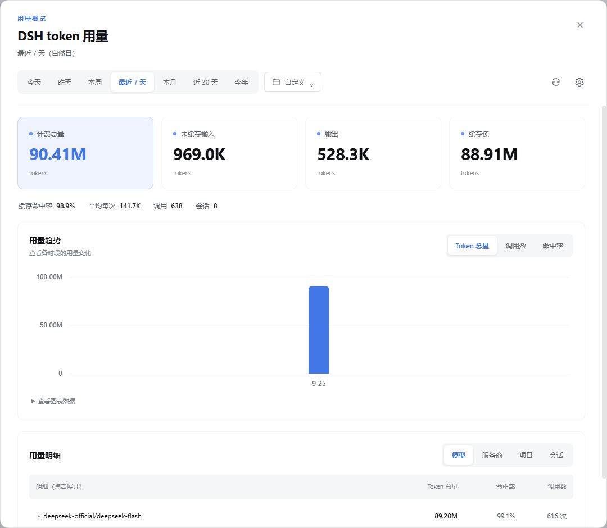
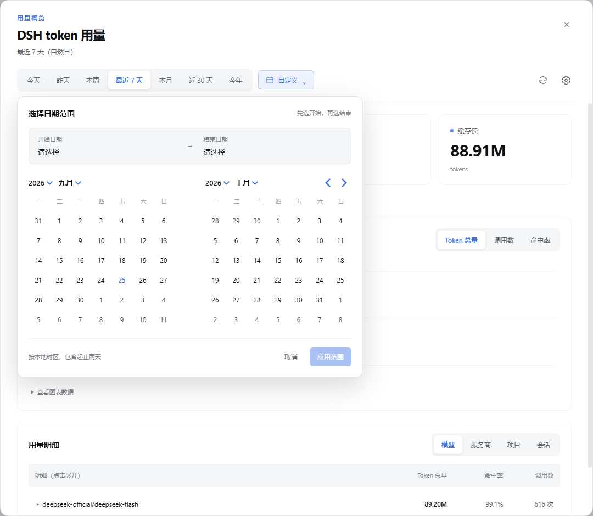

# dsh-plugin-token-report

在 DeepSeek Harness（DSH）里直接查看本机 token 用量：输入框摘要、趋势图、模型排行和自定义日期范围；需要团队汇总时，再配置身份与上报连接。

**当前版本：0.3.0** · npm 包名：`dsh-plugin-token-report` · 仓内开发包名：`@ai-token-report/dsh-plugin`

## 实际使用截图

以下截图来自 2026-09-25 本机运行的 DSH Web 与真实会话日志，仅截取插件区域。数值是该机器当时的用量，不是模拟数据，也不代表性能基准。

### 用量概览与模型明细

点击输入框上方 `TOKEN 用量` 条里的「详情」，即可查看计费总量、未缓存输入、输出、缓存读、缓存命中率、调用数和会话数。趋势支持切换 Token 总量、调用数与命中率，明细支持模型、服务商、项目和会话分组，点击行可展开，超过 10 行可翻页。



### 自定义日期范围

除了今天、昨天、本周、最近 7 天、本月、近 30 天和今年，还可以通过双月日历选择开始与结束日期。开始与结束日期既可以点日历选，也可以直接敲进输入框（`2026-09-21`、`2026/9/21`、`2026年9月21日` 都认，失焦后统一成 `2026-09-21`）；格式不对、日期不存在或开始晚于结束时，标题右侧会说明原因，「应用范围」只在区间可用时才可点。范围按本地时区计算，包含起止两天，点击「应用范围」后更新统计；生效期间按钮上直接显示所选区间（如 `09-12 – 10-06`）。



## 安装 0.3.0

需要已经安装 DSH，并使用与插件兼容的宿主模块（`@deepseek-ai/cordis ^4.0.2`、`@deepseek-ai/dsh-session-telemetry ^0.1.5-rc.1`）。Node.js 要求 **22.15.0 或更新版本**。

```bash
dsh plugin --profile web add dsh-plugin-token-report@0.3.0
```

在 `~/.dsh/profiles/web/package.json` 的 `dsh.profile.bundles` 数组中加入 `dsh-plugin-token-report`，保留已有条目。依赖安装与 bundle 声明都需要具备；已经存在的条目不要重复添加。例如：

```json
{
  "dsh": {
    "profile": {
      "bundles": [
        "@deepseek-ai/dsh-base",
        "@deepseek-ai/dsh-web-app",
        "dsh-plugin-token-report"
      ]
    }
  }
}
```

在该 profile 的 `cordis.patch.yml` 中合并以下条目：

```yaml
# 同一时间只能有一个 sessionTelemetry 后端。
- id: session-telemetry-otel
  disabled: true
```

随后重启 DSH，用终端打印的完整地址打开浏览器：

```bash
dsh --profile web --no-open
```

选择工作区后，输入框上方会出现用量条（**0.3.0 起这是默认位置**）。想让面板改到会话标题栏右上角、或两个位置都要，见上方「调整面板位置」。安装后无需单独启动本地统计网页。

> `dsh plugin` 内部调用宿主自己的包管理器。上面的安装命令用于 DSH profile；本仓开发、构建与发布使用 Bun。

## 第一次使用

1. 打开「详情」，选择需要查看的周期。首次建立索引可能需要十几秒，后续只增量读取变化的日志。
2. 切换趋势指标或明细分组查看用量来源。图表下方「查看图表数据」提供精确值。
3. 手动点击刷新即可读取最新数据；页面每 **3 秒**问一次「有没有新数」（没有就零成本），
   有新采集时按宿主缓存节奏（最多 30 秒）自动更新；切回前台标签页会立刻取一次。

**仅查看本机统计不需要署名。未署名时，插件不采集上报事件，也不上报。** 页面读取的是 DSH 已有的本机会话日志。

### 调整面板位置

面板默认出现在**输入框上方**。想让它出现在**会话标题栏右上角**、或两个位置都要，在 profile 的 `cordis.patch.yml` 里给插件加一段 `ui`：

```yaml
- id: token-report
  config:
    ui:
      position: dock      # dock(默认，输入框上方) | header(右上角) | both(两处都要)
```

| 取值 | 效果 |
|---|---|
| `dock` | 只显示输入框上方的用量条（默认） |
| `header` | 只显示标题栏右上角的胶囊；点开就是同一个详情面板 |
| `both` | 两处都显示 —— 与 0.2.0 的外观一致 |

改完**刷新页面**即可生效（位置在页面加载时确定）。三种取值共用同一个详情面板，数字口径完全一致。
也可以不改 YAML，用环境变量 `DSH_TOKEN_REPORT_UI_POSITION` 临时覆盖。

**写错的值不会让面板消失**：只认上面三个值，其它一律回退 `dock`，并在 DSH 启动日志里告警。

### 开启团队上报

在详情面板右上角点击齿轮「配置」，填写管理员提供的姓名、身份 Key 和完整上报地址，例如 `https://portal.example.com/api/v1/token-usage`。如果团队使用独立 appKey，也可以一并填写；留空使用本次身份 Key。

点击「验证并保存」后，插件先向对应服务端校验身份，姓名与部门以服务端返回值为准。**保存后重启 DSH**，新的署名与连接才会用于上报。已保存的 Key 不回显。

身份与连接保存在 `$DSH_HOME/token-report/` 下；默认 DSH_HOME 为 `~/.dsh`。插件与本地 Web 共用身份文件。部署侧固定了身份时，页面会提示配置由管理员管理。

### 让 Agent 查询

可以在 DSH 会话里要求：

```text
调用 token_usage，查看我今天的 token 用量，按模型分组。
调用 token_usage，查看最近 7 天的用量，按天显示趋势。
调用 token_usage_diagnostics，检查上报是否成功、是否有待发送数据。
```

工具注册需要宿主提供对应能力并启用 `features.tools`。查询工具只读本机日志，本身不产生上报。

## 0.3.0 功能说明

| 能力 | 使用方式 |
|---|---|
| 界面统计 | 用量条与标题栏入口（挂哪几个由 `ui.position` 决定，默认只挂输入框上方），共用详情面板 |
| 时间分析 | 预设周期、双月日历、自定义范围、趋势切换 |
| 明细分析 | 模型 / 服务商 / 项目 / 会话分组，展开与分页 |
| 本地增量查询 | SQLite 增量索引；库不可用时自动回退日志扫描并提示 |
| 身份配置 | 面板内验证署名与上报连接，重启后生效 |
| 实时上报 | 异步批量发送、磁盘 outbox、失败保留、重启重放 |
| Agent 与插件集成 | `token_usage`、`token_usage_diagnostics`、`ctx.tokenReport` |

只展示 token 数，不展示金额。只采集用量相关字段（包含模型名、工作目录、轮次等），不采集对话内容。上报失败不会阻塞 DSH 的会话循环；服务端按事件 ID 去重。

## 升级与常见问题

从旧版升级时，重新运行指定版本的安装命令，然后重启 DSH。若此前通过源码包 `@ai-token-report/dsh-plugin` 安装，请先把旧 bundle 与旧插件挂载条目替换成发布包，避免两个实例同时注册服务。

> **0.2.0 → 0.3.0 的行为变更（唯一一处）**：用量面板的默认位置改成
> `ui.position: dock` —— 默认**只出现输入框上方那条用量条**，
> 会话标题栏右侧的胶囊不再默认出现。要保留 0.2.0 的外观（两处都有），
> 在插件 `config` 里加 `ui: { position: both }`。
> 位置配错（写了别的值）不会让面板消失：一律回退 `dock` 并在启动日志里告警。

| 现象 | 处理 |
|---|---|
| `sessionTelemetry` 已注册 | 确认官方 OTel 后端已禁用，且没有重复挂载插件 |
| 没有用量入口 | 确认安装在 `web` profile、bundle 数组包含发布包名，并已重启；`features.ui` 不能关闭 |
| 401 / 未通过宿主鉴权 | 使用本次 DSH 启动时打印的完整地址重新打开 |
| 首次统计较慢 | 等待首次索引完成；如显示降级，检查 SQLite 权限与宿主 Node 版本 |
| 团队看板没有数据 | 验证并保存身份与连接后重启，再调用 `token_usage_diagnostics` 查看原因 |
| 修改配置后仍使用旧身份 | 当前进程仍绑定启动时配置，需要重启 DSH |

源码与开发文档见 [GitHub 仓库](https://github.com/zhujunzhujunzhu/ai-token-report/tree/main/packages/dsh-plugin)。

<!-- DEVELOPMENT-DOCS -->

---

## 开发与部署参考（仓内包）

以下章节针对源码直挂与二次开发，示例里的 `@ai-token-report/dsh-plugin` 是仓内包名。通过 npm 安装时使用上方的 `dsh-plugin-token-report` 安装步骤。

装在 DSH 里，**无人值守地**把本机产生的计费级 token 用量实时上报到部门服务端，
同时给同事一个「问一句就能看到自己用量」的工具，以及一块**在 DSH 界面里
一直看得见**的用量面板。

```
① 实时上报   SessionTelemetryBackend.emit(record)    ← 会话进行中，秒级
② 统计工具   token_usage / token_usage_diagnostics   ← Agent 可调用
③ 统计服务   ctx.tokenReport                        ← 其它插件可调用
④ 界面面板   输入框上方的用量条 + 标题栏徽章          ← 人直接看
```

四种形态与 CLI `dsh-token`、本地页面走**同一套聚合与同一套口径**，
所以「工具报的数」「面板上的数」「终端里的数」必然一致。

---

## 1. 一份全局配置

团队铺开时，每个人机器上的差异应当只有「身份」一项。其余全部来自同一份下发配置：

```yaml
# ~/.dsh/profiles/web/cordis.patch.yml
- id: token-report
  # ⚠️ 必须是**已发布的包名** —— loader 用它来 import
  name: '@ai-token-report/dsh-plugin'
  config:
    # ── 全局配置 ────────────────────────────────────────────────
    name: dsh-token-report                      # 插件实例名，同时上报为 client.name
    appKey: !!js `process.env.ATR_APP_KEY`      # ★ 上报凭证，走 Authorization: Bearer
    endpoint: https://portal.example.com/api/v1/token-usage   # 计费上报地址

    batch:
      maxRecords: 50                # 单批最大条数
      flushIntervalMillis: 10000    # 定时冲刷间隔（turn 结束会额外触发一次）
      timeoutMillis: 15000          # 单次请求超时

    outbox:
      enabled: true                 # 磁盘 outbox（崩溃不丢）。默认开
      dir: ~/.dsh/token-report/outbox
      maxBytes: 33554432            # 超限丢**最旧**的批并告警

    features:
      reporting: true               # 关掉即完全不上报
      tools: true                   # 注册 token_usage 工具
      service: true                 # 注册 ctx.tokenReport
      ui: true                      # 在 DSH 界面里显示用量面板（只影响显示）

    # ── 界面呈现（只影响面板挂在哪，不影响上报 / 工具 / 服务）──────
    ui:
      position: dock                # dock(默认，输入框上方) | header(标题栏右上角) | both(两处都要)
                                    # ★ 0.2.0 的外观 = both

    localDb: true                   # 默认增量 SQLite，见 §5

    # ── 身份（选填）─────────────────────────────────────────────
    # 留空则读 $DSH_HOME/token-report/identity.json（员工自己在本地页填的那份）
    # user:
    #   name: 张三
    #   token: atr-zhangsan-9f3c
    #   dept: 研发一部
```

### 取值的优先级

```
代码默认值  <  环境变量  <  插件 config
```

环境变量这一级是给 CI / 容器 / 临时排障用的：

| 环境变量 | 对应配置 |
|---|---|
| `DSH_TOKEN_REPORT_NAME` | `name` |
| `DSH_TOKEN_REPORT_APP_KEY` | `appKey` |
| `DSH_TOKEN_REPORT_ENDPOINT` | `endpoint` |
| `DSH_TOKEN_REPORT_BATCH_MAX` | `batch.maxRecords` |
| `DSH_TOKEN_REPORT_FLUSH_INTERVAL_MS` | `batch.flushIntervalMillis` |
| `DSH_TOKEN_REPORT_TIMEOUT_MS` | `batch.timeoutMillis` |
| `DSH_TOKEN_REPORT_OUTBOX` | `outbox.enabled`（`1/true/yes` 或 `0/false/no`） |
| `DSH_TOKEN_REPORT_OUTBOX_DIR` | `outbox.dir` |
| `DSH_TOKEN_REPORT_OUTBOX_MAX_BYTES` | `outbox.maxBytes` |
| `DSH_TOKEN_REPORT_LOCAL_DB` | `localDb` |
| `DSH_TOKEN_REPORT_UI_POSITION` | `ui.position`（`dock` / `header` / `both`） |
| `DSH_TOKEN_REPORT_USER_NAME` | `user.name` |
| `DSH_TOKEN_REPORT_USER_TOKEN` | `user.token` |
| `DSH_TOKEN_REPORT_DEPT` | `user.dept` |

> 前缀刻意用 `DSH_TOKEN_REPORT_` 而不是 CLI 的 `DSH_REPORT_*` ——
> 两者是不同的部署面，混用会让「我改了变量为什么没生效」变成谜题。

**写错的数字不会让 DSH 起不来**：非正数一律回退默认值并告警。
**写错的位置同样不会**：`ui.position` 只认 `dock` / `header` / `both`，其它值一律
回退 `dock` 并在启动日志里说明「写了什么、可选哪些」—— 配错位置既不会让 DSH 起不来，
也不会让面板消失。
半份身份（只填了名字没填 token）视为「这一级没配」，回退下一级 ——
半份身份比没有更危险，它会让判定误以为已署名却带着空凭证发请求。

### 默认值

| 项 | 默认 |
|---|---|
| `name` | `dsh-token-report` |
| `endpoint` | `http://127.0.0.1:8787/api/v1/token-usage` |
| `batch.maxRecords` | `50` |
| `batch.flushIntervalMillis` | `10000` |
| `batch.timeoutMillis` | `15000` |
| `outbox.enabled` | `true` |
| `outbox.maxBytes` | `33554432`（32 MB） |
| `features.*` | 全 `true`（含 `ui`） |
| `ui.position` | `dock`（输入框上方的用量条） |
| `localDb` | `true` |

---

## 2. 安装

### 2.1 先决条件

- **`appKey`**：管理员发放的上报凭证。没有它插件**不会上报**（这是合规底线）。
- **`endpoint` 可达**：默认指向本仓部门服务端。
- `@deepseek-ai/dsh-session-telemetry` ≥ `0.1.5-rc.1`（DSH 自带）。

> ⚠️ **与官方 OTel 后端互斥**：同一时刻只能挂载**一个** telemetry 后端
> （cordis 重复注册同名服务会抛错）。装了本插件就不要同时启用
> `@deepseek-ai/dsh-session-telemetry-otel`。

### 2.2 构建

```bash
bun install
bun run --filter '@ai-token-report/dsh-plugin' build
# → packages/dsh-plugin/lib/index.js   宿主半（约 75 KB，Node 侧）
#    packages/dsh-plugin/lib/client.js  浏览器半（约 26 KB，包在 __ModuleLoader__ 信封里）
#
# ⚠️ 构建**不能**加 --external '@ai-token-report/*'：
#   本仓 workspace 包的 main 指向 src/index.ts（Bun 能直接吃，Node 不能），
#   把它们 external 出去会让 DSH（跑在 Node 上）加载即失败。
#   打包产物里只保留 @deepseek-ai/* 为 external。
```

浏览器半由 `build-client.ts` 单独构建，它做两件 `bun build` 一行命令做不到的事：

1. **包 `__ModuleLoader__` 信封** —— DSH 前端只认
   `window.__ModuleLoader__.load({ id, factory })` 这种形状，工厂函数的返回值
   才是模块导出。用 CLI 的 `--banner/--footer` 拼那段带引号、花括号与换行的
   banner 太容易在 Windows 上被 shell 转义搞坏。
2. **平台模块纯度校验** —— DSH 前端只预置**固定 9 个**模块，浏览器半的
   `require()` 命中不了就在物化阶段抛错。最阴的一种是 JSX 走了**开发版**转换
   （`react/jsx-dev-runtime`）：产物看着完全正常，运行时必炸。
   构建脚本会逐个断言 `require` 的说明符都在表内，**越界直接让构建失败**。

### 2.3 放进 DSH profile

两步都要做 —— 少任何一步都不会生效：

**① `dsh.profile.bundles` 里加包名**（这决定 DSH 认不认这个包）：

```jsonc
// ~/.dsh/profiles/web/package.json
{
  "dependencies": {
    "@ai-token-report/dsh-plugin": "file:D:/Coding/ai-token-report/packages/dsh-plugin"
  },
  "dsh": {
    "profile": {
      "bundles": [
        "@deepseek-ai/dsh-base",
        "@deepseek-ai/dsh-web-app",
        "@ai-token-report/dsh-plugin"   // ← 加这里
      ],
      "patchReload": "live"
    }
  }
}
```

**② 插件的 `cordis.patch.yml` 负责 `insert`** —— 本包自带
（`package.json` 的 `dsh.bundle.patch` 指向它），格式必须是：

```yaml
# packages/dsh-plugin/cordis.patch.yml
- insert:                                  # ← 顶层是数组，元素里才是 insert
    - id: token-report
      name: '@ai-token-report/dsh-plugin'  # ← 必须是包名本身，loader 拿它去 import
```

> ⚠️ **三个格式陷阱**（都会让 DSH 起不来，且报错信息不直观）：
>
> | 写错的样子 | 报错 |
> |---|---|
> | 顶层写 `insert:` 映射而不是数组 | `overlay ... must be a top-level YAML array of loader patch entries` |
> | bundle 的 `package.json` 没有 `dsh.bundle.patch` | `profile bundle ... declares no dsh.bundle in its package.json` |
> | `name` 写别名而不是包名 | 启动时「找不到模块」 |
>
> 照抄 `@deepseek-ai/dsh-base` 的 `cordis.patch.yml` 最稳。

**③ 模块解析要通**：插件运行时只需要 `@deepseek-ai/*`（DSH 自带）。
如果包不在 `profiles/node_modules` 的解析范围内，用 junction 接一下：

```powershell
# Windows：把插件目录接到 profile 的 node_modules 下
New-Item -ItemType Junction `
  -Path "$env:USERPROFILE\.dsh\profiles\web\node_modules\@ai-token-report\dsh-plugin" `
  -Target "D:\Coding\ai-token-report\packages\dsh-plugin"
```

> ★ 这一步同时决定**界面面板会不会出现**：DSH 的客户端模块扫描会在同一个
> 解析范围里找每个插件条目的 `package.json`，读它的 `dsh.client` 声明与
> `exports["./client"]`。解析不到包 = 宿主半没有、浏览器半也没有。

**④ 🚨 必须关掉官方 OTel telemetry 后端**（与 token-report 互斥）：

```yaml
# ~/.dsh/profiles/web/cordis.patch.yml
- id: session-telemetry-otel
  disabled: true
```

不关掉它会直接启动失败：

```
service "sessionTelemetry" has been registered at <OpenTelemetrySessionBackend>
```

cordis 同一时刻只允许注册**一个** `sessionTelemetry` 服务。
该后端默认 `mode: FEEDBACK_ONLY`（只在提交反馈时上传到
`harness-telemetry.deepseeksvc.com`），关掉不影响任何本地功能。

⚠️ 官方明示限制：**新增依赖包需要重启 DSH**（`patchReload: live` 只对 patch 内容生效）。
升级插件版本同理。

### 2.4 验证装上了

```bash
# ① profile 组装里能看到插件行（最快，不起服务）
dsh --profile web --dump-config | Select-String token-report -Context 0,12

# ② 真启动
dsh --profile web --no-open
```

启动成功会打印 `dsh web: http://127.0.0.1:<port>/?token=...`。
插件启用时还会在 `$DSH_HOME/token-report/` 下**创建 `outbox/` 目录** ——
这是「后端真的构造了」最直接的证据（未启用时不会建）。

装对了的话，**界面上会直接看到用量面板**。挂哪几个由 `ui.position` 决定，
默认（`dock`）只有第一条：

- 输入框上方多一条 `TOKEN 用量 …` 的条（点「详情」直接打开弹框）；
- 会话标题栏右侧多一个 `● 2.39B 97.0%` 的胶囊（点开是浮层）—— **需要 `ui.position: both` 或 `header`**。

启动日志里还有一句 `UI 用量面板数据通道已挂载 → GET /api/tokenReport.stats（面板位置：dock）`
—— 括号里就是这次真正生效的位置，位置配了没生效时先看它。
没有这句、界面也没面板时，按下面顺序看：

| 日志/现象 | 原因 |
|---|---|
| `宿主不提供 connection 服务（非 web profile）` | 用的是 headless profile —— 预期行为，web profile 才有界面 |
| 什么都不打印，界面也没面板 | 包不在 profile 的解析范围内，或 `features.ui: false` |
| 数据通道那句有，但界面没面板 | 浏览器半没被加载 —— 查 `dsh.client` 声明与 `lib/client.js` 是否存在 |

没看到启用时，日志会说明**为什么没启用**以及**怎么配** ——
不会只留一句「没启用」让人卡住。

### 2.5 回滚

```powershell
$w = "$env:USERPROFILE\.dsh\profiles\web"
# ① 从 bundles 与 dependencies 里去掉插件（改 package.json）
# ② 从 cordis.patch.yml 里删掉 token-report 段，并把 session-telemetry-otel 的 disabled 改回 false
# ③ 删掉 junction
Remove-Item "$w\node_modules\@ai-token-report" -Recurse -Force
# ④ 删掉插件产生的数据（state.json / usage.sqlite 是本地页与 CLI 的，按需保留）
Remove-Item "$env:USERPROFILE\.dsh\token-report\outbox" -Recurse -Force
# ⑤ 重启 DSH
```

---

## 3. 未署名 / 未配凭证 = 不采集也不上报

★ **这是合规底线，代码里硬保证，不要放宽。**

| 情形 | 行为 |
|---|---|
| 没身份文件 + 没配 `user` | **不注册上报后端**，一个字节都不发，只提示一次 |
| 有身份但没配 `appKey` | 同上（提示指向 `appKey` 怎么配） |
| `features.reporting: false` | 同上（明确说明是配置关掉的） |
| 三项齐了 | 注册上报后端，开始实时上报 |

提示文案的三条原则（写在 `identity.ts` 里，别改坏）：

1. 说明**去哪里填**，而不是抱怨「你没填」
2. 明确承诺**不采集** —— 含糊其辞反而更容易被拒绝
3. 区分「token 填错了」与「管理员还没发凭证」

> 为什么不按 `unknown` 兜底上报？那是**未授权的数据采集**。
> 宁可数据缺失（看板上能看到缺口），也不要偷偷采集。

---

## 4. 对外能力

### 4.1 工具（Agent 可调用）

**`token_usage`** —— 统计本机用量。只读本机会话日志，**不产生任何上报**。

| 参数 | 说明 |
|---|---|
| `period` | `today` / `yesterday` / `week` / `lastweek` / `month` / `lastmonth` / `year` / `last7d` / `last14d` / `last30d` / `last90d`，也接受中文（`今天` / `本周` / `最近7天`） |
| `by` | 分组维度，逗号分隔：`provider` \| `model` \| `provider-model` \| `project` \| `session` \| `day` \| `hour`（默认 `provider-model`） |
| `top` | 每个维度显示前 N 行（默认 30） |
| `series` | `day` \| `hour`，给了就附带趋势 |
| `provider` / `model` | 子串过滤 |

输出里 **四项 token 分列**，且缓存命中率带口径说明：

```
DSH token 用量  |  最近 30 天（自然日）
数据来源  直扫会话日志
耗时      11196ms

=== 总计 ===
  调用数        16,437
  计费总量      2,392,609,771   (input + output + cacheRead + cacheWrite)
    未缓存输入  70,379,895
    输出        9,754,881
    缓存读      2,312,474,995
    缓存写      0
  缓存命中率    97.0%   = cacheRead/(cacheRead+input)
  缓存杠杆      32.9x
```

**`token_usage_diagnostics`** —— 回答「我的数据到底发出去了没有」。
这个插件最大的失败模式不是报错，而是**静默地不上报**（凭证过期、地址改了、
outbox 满），看板上少了几个人的数据而没人发现：

```
=== token 上报链路诊断 ===
  插件名      dsh-token-report
  上报地址    https://portal.example.com/api/v1/token-usage
  凭证        已配置（不回显）
  ...
=== 投递统计 ===
  已采集      1,234 条
  已投递      1,230 条（服务端判定重复 4，拒收 0）
  磁盘待投递  0 条 / 0 批
  请求        25 次（失败 0 次）
  最近成功    2026/9/24 10:31:20
```

> 凭证**永不回显** —— 只报「已配置 / 未配置」。

### 4.2 服务（其它插件可调用）

```ts
const svc = ctx.get('tokenReport')

await svc.query({ period: 'today', by: ['provider'] })  // → UsageResult（不可变快照）
await svc.format({ period: 'week' })                    // → 渲染好的文本
svc.config                                              // ★ 不含 appKey
svc.signed()                                            // → 身份是否就绪
```

返回值是**某一刻的快照**而不是活会话 —— 调用方不持有 SQLite 连接，
也就不可能忘记 `close()`。

### 4.3 界面面板（人直接看）

装在 DSH 的 Web 界面里，**常驻可见**，不需要问 Agent、也不需要开另一个页面。

| 挂载点 | slot | 长什么样 | 什么时候挂 |
|---|---|---|---|
| 输入框上方的用量条 | `conversation.input.dock` | 一行摘要：`TOKEN 用量 · 今天 · 2.39B tokens · 命中率 97.0% · 16,437 次调用`，右侧「详情」打开居中弹框 | `ui.position: dock`（默认）/ `both` |
| 会话标题栏右侧的徽章 | `conversation.session.header.utilities` | 一个紧凑胶囊 `● 2.39B 97.0%`，点开是居中浮层（Esc 关闭） | `ui.position: header` / `both` |

挂哪几个由 `ui.position` 决定，**默认只挂输入框上方那一条**；`both` 才是 0.2.0 的外观。
位置在**页面加载时定下来**（slot 注册是一次性的），所以改完配置要刷新页面。

两个挂载点用的是**同一份状态**（`store.ts` 里那个 store），所以数字永远一致，
而且取数只做一次 —— 这点很重要，见下面的「缓存与轮询」。

详情里有：周期切换（今天 / 昨天 / 本周 / 最近 7 天 / 本月 / 近 30 天 / 今年 / 自定义）、
**四个 token 列分列**的统计格、派生指标（命中率 / 平均每次调用）、
迷你趋势柱、按 `provider-model` 的排行，以及脚注里的
**数据来源 / 耗时 / 统计时刻 / 降级原因**。

#### 数据怎么走到页面里

```
浏览器半  fetch('/api/tokenReport.config')                 ← 挂载前先问「面板放哪」
              ↓  同源；DSH 的 /api 前缀先做 Host/Origin 栅栏 + 浏览器鉴权
宿主半    installUiRoute 注册的常量路由（不查库、不读文件）→ { position }
              ↓  ★ 取不到（旧宿主 404 / 超时）就按默认位置挂载，面板照常出现

浏览器半  fetch('/api/tokenReport.stats?period=today')     ← 同源，自带宿主会话 cookie
              ↓  DSH 的 /api 前缀先做 Host/Origin 栅栏 + 浏览器鉴权
宿主半    ctx.connection.fetch.register(...)  精确 Fetch 路由
              ↓
          queryUsage()   ← 与 CLI `dsh-token`、`token_usage` 工具**同一个函数**

浏览器半  fetch('/api/tokenReport.stats?period=today&gen=N')  ← 之后每 3 秒一次的**探针**
              ↓  宿主发现还是第 N 代 → 204（零载荷、不查库）；变了才回载荷
```

**为什么位置要单独走一条 HTTP**：DSH 的客户端插件条目**拿不到**插件的 `config`
（`__DSH_BOOT__` 的条目里只有 id / url / inject 这些字段，壳层组装条目时也只传包名），
所以部署 YAML 里的 `config.ui.position` 到不了页面。位置又必须在**注册之前**知道
（注册是一次性的，挂错了再改就等于先挂错地方），因此它不能塞进
`/api/tokenReport.stats` 那个载荷 —— 那个载荷首次返回要等冷建库，可能十几秒，
面板会先在错的位置出现再跳一下。

**为什么复用 `/api` 而不自己 `ctx.webServer.register`**：
DSH 的 web 服务器**不做任何鉴权**（`dsh-host-webserver` 的文档明写
「No server-wide TLS, authentication, or origin policy」）。本仓的约定是
「服务端默认只监听 127.0.0.1」，但监听地址可配置 —— 一旦有人绑到 `0.0.0.0`，
一条裸的用量路由就是**向整个内网公开本机用量**。挂在 `/api` 下等于免费拿到
那两道栅栏，所以这不是「多绕一层」，而是「不要把已经有的锁拆掉」。

宿主不提供 `connection` 时（headless / 非 web profile）**安静跳过**，
面板不出现，但上报、工具、服务都不受影响。启动日志会说明这一点。

#### 详情与配置

打开详情弹框后，可切换周期、查看 Token/调用数/命中率趋势，并按模型、服务商、项目、会话查看明细。
自定义范围使用 React DayPicker 中文双月日历（窄屏单月），开始与结束日期可直接在输入框里敲（多种写法都认，失焦收敛成 `YYYY-MM-DD`），也可以点日历选；格式/顺序有问题时标题右侧写明原因，只有区间可用时「应用范围」才可点。两栏始终是相邻且不同的两个月，各自独立翻月，互不牵动。按 DSH 宿主本地时区包含起止两天；刷新保留所选日期，且只有当前生效的确实是该区间时按钮上才显示它。
趋势图使用 Chart.js：Token / 调用数用柱状图，命中率用折线面积图，提供坐标轴、悬浮精确值与可展开的数据表。图表只展示宿主计算结果，关闭弹框即释放画布。
两个组件库都按需内联进浏览器产物并生产压缩，React 继续复用 DSH 实例；不依赖 CDN，也不增加宿主运行时依赖。日历样式统一加 `atr-` 前缀，避免影响宿主或其他插件。
点击明细行展开四项 token 与会话数；明细每页展示 10 行，超过一页时显示翻页与总条数，切换分组或时间范围回到第一页。明细保留全部数据，短周期趋势保留最多 31 点，今年和自定义范围保留完整序列。
切换时间时保留已有内容与范围标签，结果返回后整体更新；图表复用实例，弹框保持稳定高度。底部不再展示数据来源、耗时与读取时间，仅在查询失败或降级时提示原因。

「配置」页填写姓名、身份 Key、完整上报地址与可选的独立 appKey。
保存前向该地址对应的 `/api/v1/identity/verify` 校验身份，姓名与部门只认服务端返回值。
未署名时仍可看本机统计，但不采集、不上报；已保存的 Key 不回显。
署名与本地 Web 共用 `$DSH_HOME/token-report/identity.json`，
连接保存到同目录的 `plugin-connection.json`（原子写入、0600）。
用户保存的连接优先于部署默认连接；配置了固定 `user` 时页面只读。

**保存后重启 DSH 生效**：当前上报器仍绑定启动时的身份与连接，页面会明确提示。

#### 缓存与轮询

默认走 SQLite 增量查询；每次先检查日志变化，未变化文件跳过解压。
不同周期和工具查询对同一库串行执行，避免增量写入互相等待写锁。
手动刷新绕过响应缓存，但仍走增量 SQLite，不会强制全量重扫。
脚注显示实际数据来源、耗时和统计时刻；库不可用时明确显示直扫与降级原因。

刷新分三层，**代次探针是为了让「看一眼有没有新数」不再等于「扫一遍日志」**：

| 机制 | 周期 | 代价 |
|---|---|---|
| 代次探针（`?gen=N`） | 3 秒 | 宿主只比一个整数；没变就回 `204`，零载荷、零查询、页面零重渲染 |
| 兜底全量取数 | 120 秒 | 真查一次，兜住**库外**的变化（别的 DSH 实例、CLI `dsh-token`） |
| 用户动作 | 立即 | 切周期 / 改区间 / 点刷新 / **从后台切回前台**；后台标签页完全不取数 |

代次由宿主的上报器计数（本进程每采集到一条计费记录 +1），因此**上报未启用时它恒为 0**，
此时面板退回「每 120 秒全量取数」——与探针引入前一致，不会变成永不刷新。

新鲜度的上限是**宿主响应缓存（30 秒）**，不是 3 秒：这是刻意的 ——
热态查询要先做一次增量 ingest（实测 25~100ms，积压变更时 2.7s，
降级直扫时 3.3s，见 §4.3），而宿主与 agent 是**同一个进程**，
每 3 秒真查一次等于把同步 zstd 解码塞进 agent loop。
实测（真 HTTP 往返）：空闲时 20 次探针 = 20 × `204`、0 字节、0 次查询、平均 0.1ms。

#### 面板的失败模式（都是刻意不静默的）

| 现象 | 原因 | 面板会显示 |
|---|---|---|
| 面板完全不出现 | 浏览器半没被加载：`dsh.client` 声明缺了 `exports["./client"]`，或包不在 profile 的 `node_modules` 里 | 什么都不显示（这一类只能查 DSH 启动日志） |
| 面板完全不出现 | slot 名字与 DSH 声明不一致 | 什么都不显示 —— 所以名字被单测钉住了（`test/client/mounting.test.ts`） |
| 面板在，显示 404 | 宿主没有 `connection`（非 web profile）或 `features.ui: false` | `宿主未提供用量数据通道（… 返回 404）…` |
| 面板在，显示 401 | 页面不是从带 token 的 DSH 地址打开的 | `未通过宿主鉴权（HTTP 401）…` |
| 面板在，显示格式错 | 返回的是 SPA 兜底的 HTML，或宿主版本不匹配 | `响应不是合法 JSON` / `响应格式不认识（缺少 totals）` |

★ 最后三条都带**具体动作指向**，不是统一一句「加载失败」——
「会话目录不在」和「路由没装上」的处置完全不同，混在一起只能靠猜。

---

## 5. 两条数据源，且如实标注

| `source` | 路径 | 特点 |
|---|---|---|
| `local-db` | 本机 SQLite 增量库（`@ai-token-report/core/db`） | 增量更新；Bun 使用 bun:sqlite，Node 使用 node:sqlite |
| `scan` | 直接扫会话日志（`@ai-token-report/core`） | 慢（冷态 10~13s），但任何运行时都能跑 |
| `none` | 没找到任何会话日志 | —— |

`source` 与 `degradedReason` 都会**如实带在结果里**。不允许在降级时假装数据来自库 ——
「这次为什么慢了 30 倍」必须能从输出里直接看出来。

> `localDb` 默认 `true`。core/db 随插件内联打包，只有 SQLite 内建驱动在运行时加载。
> `localDb: false` 用于排障对照；库不可用时由 `openStats()` 扫描一次并返回降级原因，
> 插件不会再扫第二遍，也不会把全量记录取回后重算 SQL 已能完成的聚合。
>
> 产物验证：`bun run packages/dsh-plugin/verify/verify-sql.ts`。
> 如果 `bun run` 的 PATH 把 `node` 指向 Bun shim，请通过 `ATR_NODE_BIN` 指定真实 node.exe。
> 验证覆盖 Node SQL、直扫逐字段一致、热态、追加记录和降级。

---

## 6. 可靠性设计

| 要求 | 做法 |
|---|---|
| 不拖慢主循环 | 🚨 `emit()` 只做「折叠 + 数组 push」，零 IO；发送全在异步链路 |
| 崩溃不丢 | 磁盘 outbox，`pending-*` / `inflight-*` 两态 + 启动重放 |
| 网络抖动 | 单次请求不重试，失败整批留在 outbox，下个周期再发 |
| 停机排空 | `shutdown()` 先把内存队列落盘，再尝试发一次 |
| 重复投递 | 服务端按 `event_id` 幂等；客户端只保证 at-least-once |
| 主动降级 | 后台不可达时**只留在本地**，绝不阻塞或抛错影响 agent |

### outbox 的两态与崩溃窗口

```
pending-<ts>-<pid>-<seq>.jsonl    ← 新攒的批，还没发
inflight-<ts>-<pid>-<seq>.jsonl   ← 已发出但还没收到响应
```

- **先落 pending，再发请求**：发送前崩溃 → 数据已在磁盘上。
- **发送前 rename 成 inflight**：明确标记「这批可能已经到服务端了」。
- **成功响应后删除 inflight**；**失败则 release 回 pending**。
- **启动时把 inflight 全改回 pending 并重放** —— 这是「崩溃不丢」的兑现点。

重放会不会重复上账？**不会。** `event_id = sessionId:seq` 由服务端
`ON CONFLICT DO NOTHING` 去重。**宁可重发，不可漏发。**

超限时丢**最旧**的批并计入 `droppedBatches` 告警 —— 静默丢弃是不可接受的。

---

## 7. 隐私边界（🚨 不要放宽）

只上报 **token 数值 + 模型名 + 工作目录 + 轮次**，绝不带上对话内容。

`includeContent` **没有配置项** —— 它在类型与实现上都不存在，
所以不存在「配置写错就把内容发出去」的可能。代码层面另有两道保险：

1. **`session-telemetry/record` 脱敏瀑布**：DSH 的这条瀑布**默认不带任何规则**
   （记录会原样带出文件内容与命令输出）。插件自己挂一条**白名单**规则，
   把 body 裁到只剩 `usage` / `message.source` / `turn` / `step`。
   用白名单而不是黑名单：DSH 新增字段时，没在白名单里的一律不外发。
2. **`fold.ts` 只取需要的字段**：折叠后的记录结构里根本没有内容字段。

`sharing = 'full'` 是**部署策略声明**（「本部署全量共享会话遥测」），
不是投递回执。团队统一安装、员工已知情的前提下才成立 ——
合规评审会问到这里，改之前先在内部文档里说清楚。

---

## 8. 开发与验证

```bash
bun test packages/dsh-plugin            # 214 个用例（fold / config / outbox / reporter / apply / identity / 界面）
bun run --filter '@ai-token-report/dsh-plugin' typecheck
bun run --filter '@ai-token-report/dsh-plugin' build
```

五层验证脚本，**从内到外逐层接近真实**：

| 脚本 | 层次 | 断言数 | 验证什么 |
|---|---|---|---|
| `bun test packages/dsh-plugin` | 单元 | 214 | 折叠口径 / 配置优先级 / **面板位置** / outbox 崩溃不丢 / 热路径只入队 / **界面：格式、取数状态机、挂载点、离屏渲染** |
| `verify/verify-plugin.ts` | 端到端冒烟 | 55 | **真 HTTP 往返** + 真扫日志 + 崩溃恢复（假 ctx） |
| `verify/verify-cordis-load.ts` | 真实框架装载 | 10 | 打包产物挂进**真 cordis Context**，含 `inject` 形状 |
| `verify/verify-resolution.ts` | **宿主语义** | 9 | 用 **Node**（不是 Bun）解析并加载打包产物 |
| `verify/verify-client-bundle.ts` | **浏览器半产物** | 32 | 真跑 `lib/client.js`：信封形状 / **平台模块纯度** / 双半路由一致 / **三种位置各注册哪些 slot** / slot 注册 |
| `verify/diagnose-boot.ts` | 排障工具 | — | profile 里哪个包 import 就炸，展开完整 cause 链 |

另有三个辅助脚本：

```bash
bun run packages/dsh-plugin/verify/probe-activation.ts      # apply() 到底有没有被调用
bun run packages/dsh-plugin/verify/e2e-receiver.ts 18787    # 起一个真实接收端，供真实 DSH 会话验证
bun run packages/dsh-plugin/verify/repro-boot-failure.ts    # 复现激活失败并展开 cause
```

### 为什么「界面」也要有产物层的验证

`bun test` 跑的是 `src/client/**` 的**源码**，证明的是代码逻辑对；
但装进 DSH 的是**打包产物**，中间隔着 `bun build` + 一层 `__ModuleLoader__` 信封。
`verify-client-bundle.ts` 补的就是这段，它抓的是只有产物上才会出现的三类问题：

1. **信封没包对**（`id` 写错 / 没包 `factory`）→ DSH 报
   `loaded without registering "<pkg>" via __ModuleLoader__.load`，而且只在浏览器里。
2. **引用了模块表里没有的模块**（最典型：JSX 走了开发版转换）→ 物化阶段抛错。
3. **`dsh.client` 声明与产物对不上** → DSH **启动直接失败**
   （`ClientPackageCompositionError`），不是「面板不出现」。

它还断言了**宿主半与浏览器半对路由路径的看法一致** —— 两边各写一个字面量
是这类双半插件最容易长出来的静默 bug（面板永远 404）。

### 为什么必须跑「真实装载」这两层

单测全部用**假 ctx**，能证明**插件的逻辑**对，但证明不了**插件能被 DSH 装上去**。
本次安装验证实测抓到三个只有真实装载才会暴露的问题：

**① cordis 的 `ctx.get(name)` 返回服务代理，而 JS 私有字段（`#x`）穿不过 Proxy。**
任何在方法体里访问 `this.#x` 的公开方法，经代理调用都会抛
`TypeError: Cannot access invalid private field`。

而 `emit()` 正是被代理调用的 —— coordinator 持有的是代理对象，
也就是说**每一次会话事件都会炸**。单测里 `this.emit(...)` 拿到的是真实例，所以全绿。

**② `inject` 写在类上会静默失效。**
类根本不会被实例化（`apply()` 是被直接调用的），loader 读的是**插件条目对象**的
`inject`。写在类上的结果是：插件照常 import、`apply()` 也照常跑，
但「先等依赖就绪」的保证没了。

**③ 宿主是 Node，不是 Bun。**
本仓 workspace 包的 `main` 指向 `src/index.ts`（Bun 直接吃，Node 不能），
把它们 external 出去会让 DSH 加载即失败；`bun:sqlite` 被 bundler 提到顶层同理。

由此定下的规矩：**热路径与诊断入口一律不依赖私有字段**。
`emit` / `flush` / `shutdown` 走闭包实现的 `sink`，
`reporterStats` 是构造时挂上的可调用自有属性。

### 真实 DSH 会话的端到端实测结果

2026-09-24 在本机用 headless profile 跑了一次真实会话（插件 + 真实接收端），
服务端收到并落库的完整载荷：

```json
{
  "authorization": "Bearer <appKey>",
  "schemaVersion": 1,
  "client": { "name": "dsh-token-report", "userId": "张三", "userName": "张三", "dept": "研发一部" },
  "records": [{
    "event_id": "session-63fe9359-...:17",
    "session_id": "session-63fe9359-...",
    "seq": 17,
    "ts": 1790245427069,
    "provider": "dashscope",
    "model": "deepseek-v4.1-flash",
    "input_tokens": 10882,
    "output_tokens": 1,
    "cache_read_tokens": 0,
    "cache_write_tokens": 0,
    "reasoning_tokens": 0,
    "total_tokens": 10883,
    "cwd": "D:\\Coding\\ai-token-report",
    "turn": 1,
    "step": 1
  }]
}
```

逐项核对：appKey 只走 `Authorization` 头（请求体里没有）；**四个 token 列分列未合并**；
`total_tokens` 等于四项之和；身份来自服务端认可的署名文件而非客户端自填。

同时实测了两条合规行为（用真实会话 + 真实接收端计数验证）：

| 场景 | 结果 |
|---|---|
| 有身份 + 有 `appKey` | ✅ 收到 1 条记录 |
| 有身份 + `appKey` 为空 | ✅ 跑完整会话，**接收端 0 新增**，outbox 目录未创建 |
| 有 `appKey` + 无身份文件 | ✅ 跑完整会话，**接收端 0 新增**，outbox 目录未创建 |

### 文件分工

| 文件 | 职责 |
|---|---|
| `src/index.ts` | 插件入口：`apply()` 装配、`TokenReportBackend`、脱敏规则 |
| `src/config.ts` | 全局配置归一化（默认值 / 环境变量 / 校验） |
| `src/fold.ts` | ★ 原始事件 → 计费记录（纯函数，唯一会算错数的地方） |
| `src/outbox.ts` | 磁盘 outbox（两态 + 启动重放） |
| `src/reporter.ts` | 内存队列 → 批量 → HTTP（热路径只入队） |
| `src/stats.ts` | 统计查询与渲染（**不实现任何公式**） |
| `src/identity.ts` | 身份解析（复用 core 的存储，与本地页共用同一份文件） |
| `src/ui-bridge.ts` | 宿主侧 UI 数据通道：`/api/tokenReport.stats` + `/api/tokenReport.config`（面板位置）+ TTL 缓存 + 并发合并 |
| `src/client/protocol.ts` | ★ **双半唯一契约**：载荷类型、周期、**面板位置枚举与配置解析**、响应解析（零依赖，两边都能 import） |
| `src/client/store.ts` | 浏览器侧取数状态机（`fetch`/时钟可注入，因此可单测） |
| `src/client/format.ts` | 纯展示格式（不是口径公式，见文件头注释） |
| `src/client/components.tsx` | 两个挂载点的 React 组件 |
| `src/client/styles.ts` | `<style>` 注入（全部用 `--dsw-alias-*` 主题变量） |
| `src/client/index.ts` | 浏览器半入口：`apply()` + 取面板位置（取不到回退默认并照常挂载）+ 按位置注册 slot |
| `build-client.ts` | 浏览器半构建：`__ModuleLoader__` 信封 + **平台模块纯度校验** |

> ⚠️ **双环境的 tsconfig**：`tsconfig.json` 管宿主半（`lib: ES2022`，无 DOM），
> `tsconfig.client.json` 管浏览器半与它的测试（`lib` 含 DOM）。
> 拆开是为了**不让宿主半看见 `document`、也不让浏览器半看见 `node:*`** ——
> 合并成一个 tsconfig 会让「浏览器半里 import 了 node 内建」在类型层面合法，
> 而那种错误只有到了用户浏览器里才会炸。`package.json` 的 `typecheck`
> 两个都会跑。

### 三个「只有真实装载才能发现」的坑（都真实踩过）

| 坑 | 症状 | 规矩 |
|---|---|---|
| **cordis 服务代理 vs JS 私有字段** | 每次会话事件都抛 `Cannot access invalid private field`，而单测全绿 | 热路径与诊断入口一律不依赖 `this.#x`；见 §8 开头 |
| **`inject` 写在类上** | 插件能 import、`apply()` 也跑，但依赖注入的等待语义静默失效 | `inject` 必须在 **`default` 导出**上（类根本不会被实例化） |
| **bundler 提前拉入 `bun:sqlite`** | DSH（Node）加载插件即 `ERR_UNKNOWN_BUILTIN_MODULE` | 动态 import 的说明符要**构建期不可静态分析**（用变量拼） |

这三条都由 §8 的验证脚本兜住，改插件后**必须**跑 `verify-cordis-load.ts`。

---

## 9. 排障

### 9.1 安装期

| 现象 | 原因 | 处理 |
|---|---|---|
| `cannot resolve profile bundle "@ai-token-report/dsh-plugin"` | `dsh.profile.bundles` 加了，但 profile 的 `node_modules` 里解析不到 | 见 §2.3 ③，用 junction 或 `file:` 依赖接上 |
| `profile bundle ... declares no dsh.bundle in its package.json` | 包的 `package.json` 缺 `dsh.bundle.patch` | 加 `"dsh": { "bundle": { "patch": "./cordis.patch.yml" } }` |
| `overlay ... must be a top-level YAML array of loader patch entries` | `cordis.patch.yml` 顶层写成了 `insert:` 映射 | 顶层必须是数组，`- insert:` 是数组元素 |
| `service "sessionTelemetry" has been registered at <OpenTelemetrySessionBackend>` | 与官方 OTel 后端冲突 | 见 §2.3 ④，disable 掉 OTel |
| `ERR_UNKNOWN_BUILTIN_MODULE: bun:sqlite` | 构建时把 `@ai-token-report/*` external 出去了，或 bundler 把 `bun:sqlite` 提到顶层 | 见 §2.2 的构建命令 |
| `ERR_UNSUPPORTED_ESM_URL_SCHEME` | `file:` 依赖写成了 Windows 路径 | 用 `file:D:/...` 正斜杠形式 |

### 9.2 运行期

| 现象 | 原因 | 处理 |
|---|---|---|
| 启动日志说「尚未署名」 | 没有身份文件 | 跑 `dsh-token --web` 在页面里填，或配 `config.user` |
| 启动日志说「未配置上报凭证」 | 没配 `appKey` | 配 `appKey` 或 `DSH_TOKEN_REPORT_APP_KEY` |
| 看板上没有我的数据 | 凭证过期 / 地址改了 / outbox 满 | 跑 `token_usage_diagnostics` 看 `lastError` 与 `磁盘待投递` |
| `$DSH_HOME/token-report/outbox` 目录不存在 | 上报后端从未构造（未署名 / 没 appKey / `features.reporting: false`） | 看启动日志给的原因；这是**预期行为**不是故障 |
| 工具报的数比看板少 | 正常 —— 看板是服务端累计，工具只看本机日志 | 用 `period` 对齐时间窗 |
| 统计很慢（10s+） | 走了直扫路径 | 确认 `localDb` 与宿主运行时；`source` 字段会如实标注 |
| 界面没有用量面板 | 用的不是 web profile，或 `features.ui: false`，或浏览器半没被加载 | 见 §2.4 的三行对照表；启动日志会说明「数据通道已挂载」还是「宿主不提供 connection」 |
| **升级后标题栏徽章不见了** | **预期行为**：0.3.0 起 `ui.position` 默认 `dock`，只挂输入框上方那条 | 要徽章就配 `ui.position: both`（= 0.2.0 的外观）或 `header` |
| 配了 `ui.position` 但界面没变 | 值写错了（已回退 `dock`），或页面没刷新（位置在页面加载时定下来） | 看启动日志里 `ui.position` 的 warn 与「面板位置：」那句，然后**刷新页面** |
| 面板位置忽然回到默认 | 读位置那条路由没通（旧宿主 → 404、中间层超时） | 浏览器控制台会有一条 `读取面板位置失败（…）`；面板**照常出现**，只是位置是默认的 |
| 面板显示「返回 404」 | 宿主没有 `connection` 服务，或路由没注册上 | 看启动日志有无 `UI 用量面板数据通道已挂载`；headless 下是预期行为 |
| 面板显示「未通过宿主鉴权（401）」 | 页面不是从带 `?token=` 的 DSH 地址打开的 | 用 `dsh web` 打印的那个完整地址重开页面 |
| 面板显示「响应格式不认识（缺少 totals）」 | 宿主半与浏览器半版本不一致（升级后没重启 DSH） | 重启 DSH；两边都由同一个 `lib/` 提供，重启即可对齐 |
| 面板数字长时间不动 | 没在干活时数据本来就不变；代次探针每 3 秒问一次，有新采集才会重新取数（真查受宿主 30 秒缓存限制） | 点「刷新」绕过缓存立刻取新值；切回前台标签页也会立刻取一次 |
| 面板数字 30 秒才跳一次 | **预期行为**：探针采样是 3 秒，但真查询受宿主 30 秒缓存限制（见 §4.3 的实测依据） | 点「刷新」立刻取新值 |
| DSH 启动报 `client bundle not found` | 改了插件但没重新构建浏览器半 | `bun run --filter '@ai-token-report/dsh-plugin' build` |

### 9.3 宿主环境（本机实测踩到）

`dsh` 的启动 shim 硬编码用 **`node`** 跑 `lib/bin.js`。如果 `node` 不在 PATH 上
（例如 nvm 的符号链接 `C:\nvm4w\nodejs` 被清空），shim 会**回退到 bun 的 node 兼容层**，
于是 `node:module` 缺 `stripTypeScriptTypes`，报：

```
SyntaxError: Export named 'stripTypeScriptTypes' not found in module 'node:module'
```

**这与插件无关** —— 移除插件后同样会失败。排查方式：

```bash
bun run packages/dsh-plugin/verify/diagnose-boot.ts web   # 逐个包试 import，指出谁炸
```

修法是让 `node` 回到 PATH（`nvm use <version>` 重建符号链接），
或直接用绝对路径调真 Node：

```powershell
& "D:\Program Files\nvm\v24.20.0\node.exe" `
  "$env:USERPROFILE\.bun\install\global\node_modules\@deepseek-ai\dsh\lib\bin.js" `
  --profile web --no-open
```

---

## 10. 相关文档

| 主题 | 位置 |
|---|---|
| 口径公式（唯一真源） | `packages/shared/src/metrics.ts` |
| 上报与查询契约 | `packages/shared/src/protocol.ts` |
| 服务端接收接口 | `ARCHITECTURE.md` §5.2 |
| 身份署名与归属 | `.agents/skills/identity-attribution/SKILL.md` |
| 会话日志解析 | `.agents/skills/dsh-session-log-parsing/SKILL.md` |
| 工程约定 | `.agents/skills/repo-conventions/SKILL.md` |
| 插件方案（历史） | `docs/插件方案.md` |

