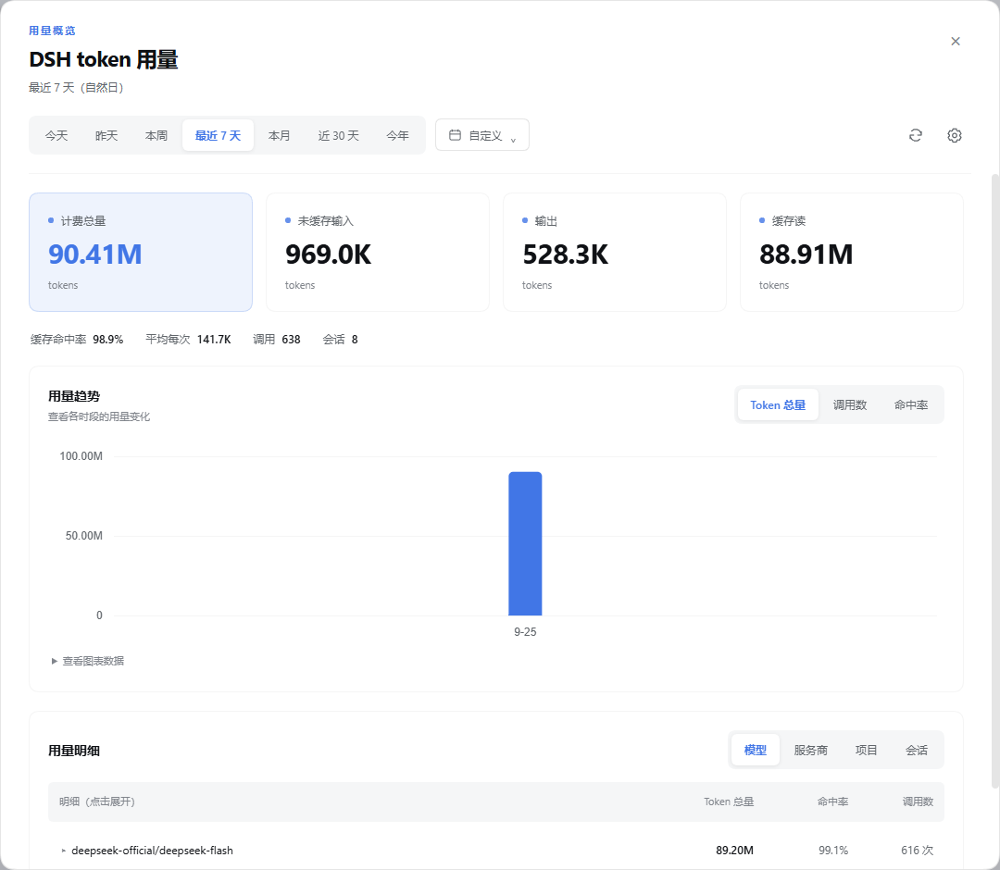
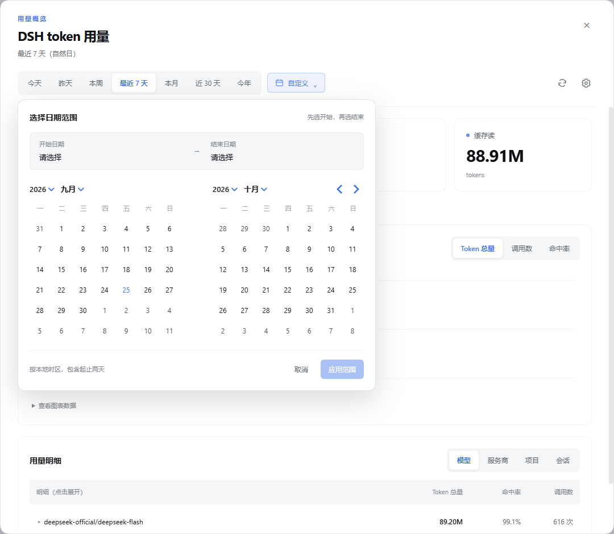

# dsh-plugin-token-report

在 DeepSeek Harness（DSH）里直接查看本机 token 用量：输入框摘要、趋势图、模型排行和自定义日期范围；需要团队汇总时，再配置身份与上报连接。

npm 包名：`dsh-plugin-token-report` · 仓内开发包名：`@ai-token-report/dsh-plugin`

## 实际使用截图

以下截图来自 2026-09-25 本机运行的 DSH Web 与真实会话日志，仅截取插件区域。数值是该机器当时的用量，不是模拟数据，也不代表性能基准。

### 用量概览与模型明细

点击输入框上方 `TOKEN 用量` 条里的「详情」，即可查看计费总量、未缓存输入、输出、缓存读、缓存命中率、调用数和会话数。趋势支持切换 Token 总量、调用数与命中率，明细支持模型、服务商、项目和会话分组，点击行可展开，超过 10 行可翻页。



### 自定义日期范围

除了今天、昨天、本周、最近 7 天、本月、近 30 天和今年，还可以通过双月日历选择开始与结束日期。开始与结束日期既可以点日历选，也可以直接敲进输入框（`2026-09-21`、`2026/9/21`、`2026年9月21日` 都认，失焦后统一成 `2026-09-21`）；格式不对、日期不存在或开始晚于结束时，标题右侧会说明原因，「应用范围」只在区间可用时才可点。范围按本地时区计算，包含起止两天，点击「应用范围」后更新统计；生效期间按钮上直接显示所选区间（如 `09-12 – 10-06`）。



## 安装最新稳定版

需要已经安装 DSH **`0.1.7-rc.2` 或更高、`0.3` 之前**（本插件已在 `0.1.7-rc.2` 与 `0.2.0-rc.2` 上实测启动），并使用同代宿主模块（`@deepseek-ai/cordis ~4.0.4`）。不要把 0.1.5 / 0.1.6 的 telemetry 与 0.1.7 及以后的宿主混装，否则旧版会把合法会话日志误报为损坏。Node.js 要求 **22.15.0 或更新版本**。

```bash
dsh plugin --profile web add dsh-plugin-token-report@latest
```

`dsh plugin add` 会自动在 `~/.dsh/profiles/web/package.json` 的 `dsh.profile.bundles` 中登记发布包。检查它只出现一次，且没有旧源码包 `@ai-token-report/dsh-plugin`；**不要再手动 insert 插件**。正常列表例如：

```json
{
  "dsh": {
    "profile": {
      "bundles": [
        "@deepseek-ai/dsh-base",
        "@deepseek-ai/dsh-web-app",
        "dsh-plugin-token-report"
      ]
    }
  }
}
```

在该 profile 的 `cordis.patch.yml` 中合并以下条目：

```yaml
# 同一时间只能有一个 sessionTelemetry 后端。
- id: session-telemetry-otel
  disabled: true
```

随后重启 DSH，用终端打印的完整地址打开浏览器：

```bash
dsh --profile web --no-open
```

选择工作区后，输入框上方会出现用量条（**0.3.0 起这是默认位置**）。想让面板改到会话标题栏右上角、或两个位置都要，见下方「调整面板位置」。安装后无需单独启动本地统计网页。

> `dsh plugin` 内部调用宿主自己的包管理器。上面的安装命令用于 DSH profile；本仓开发、构建与发布使用 Bun。

## 在 DSH Desktop（桌面端）上安装

桌面端与命令行版走的是**同一条装配路**，只是 home 与 profile 换成了 Desktop 自己那套；
但桌面端的**图形入口装不了本插件**，所以下面给的是命令行步骤。

> 照着逐条执行、带核对与回滚的交付版在**仓内** `docs/桌面端安装交付清单.md`
> （该文件不在 npm 包里，所以这里只写路径不写相对链接）；本节是同一套步骤的说明版。

### 为什么不能用桌面端的插件界面装

| 入口 | 能不能装 | 原因 |
|---|---|---|
| 侧边栏「插件」（社区插件市场 `dshmarket`） | ❌ | 市场**只允许安装 [awesome-dsh-plugin](https://awesome-dsh-plugin.com) 精选列表内的来源，其它一律拒绝**（其 README 明写）。实测该目录 `plugins.json`（约 5 MB）里 `token-report` **0 命中** |
| 上游「插件」管理页（`@deepseek-ai/dsh-plugin-manager`） | ⚠️ 未实测 | 它接受 npm 包名 / 本地路径 / tarball / git，但在 Desktop 上包操作归 Desktop shell 所有，会走下面的 generation 管线 |

想让同事在界面里一键装，唯一途径是把包 PR 进 [awesome-dsh-plugin](https://github.com/awesome-dsh-plugin/awesome-dsh-plugin) 精选列表。

### 桌面端与命令行版的四个差别

| | 命令行版 | DSH Desktop |
|---|---|---|
| DSH home | `~/.dsh`（或 `$DSH_HOME`） | `%APPDATA%\dsh-desktop\harness`（macOS：`~/Library/Application Support/dsh-desktop/harness`） |
| profile | 任意 | **只有 `web`** —— Desktop 只暴露这一个，别的名字直接抛错 |
| 宿主 | 你自己装的 `dsh` | Desktop **自带一整套** harness，在 `<安装目录>\resources\app.asar.unpacked\node_modules\` 下（本机实测 `@deepseek-ai/dsh` = `0.1.7-rc.2`、`@deepseek-ai/cordis` = `4.0.4`、随包 Node `v24.9.0`） |
| 包操作 | 你调 `dsh plugin …` | Desktop 启动时会做 profile maintenance：把非市场来源的插件迁成**不可变 generation**（`.generations/live/<...>`，一次 rename 上线），并写 `dsh.desktop.generationProjection` 与 `pnpm.overrides`；迁移失败会写 `profiles/web/.generations-deferred.json` 并**冻结**该迁移 |

其余一律相同：数据目录仍是 `~/.ai-token-report`，**与命令行版共用**（身份 / appKey 填一次两边都生效，见上方「多套 DSH 并存」）；会话日志按本机全部 DSH 的**并集**统计。

### 步骤

**① 退出 DSH Desktop**（要写 profile 与 `node_modules`）。

**② 打开一个 PowerShell**，把 home、宿主入口与 **Desktop 自己的 pnpm** 都指过去：

```powershell
# 安装目录按实际替换（本机在 D:\Program Files\DSH Desktop）
$desktopRoot = "D:\Program Files\DSH Desktop"
$desktopDsh  = "$desktopRoot\resources\app.asar.unpacked\node_modules\@deepseek-ai\dsh\lib\bin.js"

$env:DSH_HOME = "$env:APPDATA\dsh-desktop\harness"
$env:PATH     = "$env:DSH_HOME\.desktop-bin;$env:PATH"   # ★ 用 Desktop 的 pnpm，别用系统里那个
```

> `PATH` 这一行不是可有可无：Desktop 的 `pnpm.cmd` 会在 pnpm 跑动期间临时排除 generation 投影，
> 换成另一个 pnpm 就绕开了这层保护。

**③ 装包**（两种 spec 二选一）：

```powershell
# npm 稳定版
node $desktopDsh plugin --profile web add dsh-plugin-token-report@latest

# 本地 tarball：未发布的新版本 / 离线分发。
#   先在仓里 `bun run publish:plugin:dry`（只打包、不发布），tgz 落在 .artifacts/releases/<时间戳>/ 下。
#   ★ 路径用正斜杠；反斜杠会报 ERR_UNSUPPORTED_ESM_URL_SCHEME
node $desktopDsh plugin --profile web add file:D:/Coding/ai-token-report/.artifacts/releases/<时间戳>/dsh-plugin-token-report-0.7.0.tgz
```

`add` 会自动在 `profiles/web/package.json` 的 `dsh.profile.bundles` 里登记包名；**不要再手动 `insert`**。

**④ 合并 OTel 禁用**（`profiles/web/cordis.patch.yml`；从 `~/.dsh` 导入过配置的机器通常已经有了）：

```yaml
- id: session-telemetry-otel
  disabled: true
```

**⑤ 核对**（只读，不起服务）：

```powershell
node $desktopDsh plugin --profile web list              # 本机实测：dsh-plugin-token-report@0.7.0
node $desktopDsh --profile web --dump-config | Select-String token-report
```

**⑥ 重启 DSH Desktop。** 面板出现即装好（默认输入框上方；位置在面板「配置」里改，保存即生效）。

### 装好之后

- 启动日志会打印 `UI 用量面板数据通道已挂载 → GET /api/tokenReport.stats（面板位置：…）`。
- 桌面端看不到宿主的终端输出（它写进 `%APPDATA%\dsh-desktop\logs\harness.log`），本次启动的完整地址（含 `?token=`）
  就在那行 `dsh web: http://127.0.0.1:<端口>/?token=…` 里。想确认界面数据通道真的在跑，就用它取一次配置路由
  （`/api` 前面有 Host/Origin 栅栏，所以要带 `Origin` 与上一步拿到的 cookie）：

  ```powershell
  $url = "http://127.0.0.1:<端口>/?token=<启动日志里那串>"
  $jar = "$env:TEMP\dsh-cookies.txt"
  curl.exe -s -o NUL -c $jar $url
  curl.exe -s -b $jar -H "Origin: http://127.0.0.1:<端口>" "http://127.0.0.1:<端口>/api/tokenReport.config"
  # 本机实测：200 + {"position":"dock"}
  ```

- 首次使用、填服务端与 appKey、看「上报调试」，都与命令行版一致，见「第一次使用」与「开启团队上报」。

### 三个坑

1. 🚨 **版本窗口**：当前 `peerDependencies` 是 `>=0.1.7-rc.2 <0.3.0-0`，**放宽后的窗口从 `0.7.0` 起就在 npm 上**（`latest` = `0.7.0`；`0.6.0` 及更早那一版钉的是精确 `0.1.7-rc.2`）。宿主启动时由 `dsh-app-boot` 的 `evaluatePluginCompatibility` 逐个 peer 做 `semver.satisfies(runtime, range, { includePrerelease: true })`，**任一不满足就跳过整个 bundle** —— 日志只有一行 `skipping profile bundle …`，表现是「面板不见了 + 一条也不上报」，**不是报错**。所以：
   - Desktop 自带的 `0.1.7-rc.2`（以及 `0.2.x`）都在窗口内，**装 `@latest` 即可，不需要为了拿放宽窗口去手工打 tarball**（tarball 只在「装未发布版本」时才用得上）。
   - 反过来，Desktop 升到 `0.3.0` 及以后会被跳过。那时要么等插件放宽并复验，要么按 §9.1 最后一行用 `allow-version … --accept-risk`（自担风险，不等于已验证）。
2. **不要把仓内源码包 `@ai-token-report/dsh-plugin` 装进 Desktop**：它的 `main` 指向 `src/index.ts`，而宿主跑在 **Node**（只有 Bun 直接吃 ts），加载即失败。桌面端要用构建产物、tarball 或发布包。
3. **升级 / 卸载走同一条路，不要只手改 `package.json`**：一旦 Desktop 的 generation 迁移成功，插件会被搬进不可变的 `.generations/live/<...>`，那时只有重新 `add` 才换得了版本（`plugin remove` 会走 Desktop 的 generation 下线流程）。

## 第一次使用

1. 打开「详情」，选择需要查看的周期。首次建立索引可能需要十几秒，后续只增量读取变化的日志。
2. 切换趋势指标或明细分组查看用量来源。图表下方「查看图表数据」提供精确值。
3. 手动点击刷新即可读取最新数据；页面每 **3 秒**问一次「有没有新数」（没有就零成本），
   有新采集时按宿主缓存节奏（最多 30 秒）自动更新；切回前台标签页会立刻取一次。

**仅查看本机统计不需要署名。未署名时，插件不采集上报事件，也不上报。** 页面读取的是 DSH 已有的本机会话日志。

### 多套 DSH 并存（DSH Desktop / 命令行 / 第三方客户端）

一台机器上同时装着多套 DSH 时（命令行版 `~/.dsh`、DSH Desktop 的 `%APPDATA%\dsh-desktop\harness`……），
插件缺省把**它们的会话日志一起统计**。发现是**结构驱动**的 —— 候选目录里只有**真的有 `sessions` 子目录**
的才算一个根 —— 所以面板上的数字是多套 DSH 的**并集**，接入新的第三方客户端不需要改配置。

两套 DSH 的会话经常互为镜像（同一份日志被两边各记一份）。镜像按 `event_id = <sessionId>:<seq>` 去重、
**只算一次**，所以「并集**小于**各自相加」是正确结果，不是漏扫。启动日志与 `token_usage_diagnostics`
会逐一列出这次实际读到的根 —— 「我的数据到底读了哪几处」不会只给一个数字。

**署名、连接配置与本地索引库都在同一个「数据目录」里，缺省 `~/.ai-token-report/`，它与会话日志根无关**，
所以多套 DSH 缺省就共用同一份身份与配置，Desktop 里不会再出现「尚未署名」，**不需要任何配置**：

```
<数据目录>/identity.json            ← 署名（token 就是 appKey）
<数据目录>/plugin-connection.json   ← 面板里填的服务端地址 / appKey / 间隔 / 位置 / 会话日志根
<数据目录>/usage.sqlite             ← 本地增量索引库（日志的派生物，可删可重建）
<数据目录>/outbox/                  ← 磁盘 outbox（崩溃不丢数据）
```

只有两种情况才需要动配置：想**钉住统计范围**（只看其中几处）用 `dshHomes` ——
**面板里就能改**（齿轮「配置」→「会话日志根」，保存即生效），也可以用部署配置
`dshHomes` 或环境变量 `DSH_TOKEN_REPORT_DSH_HOMES` 统一钉死；
想**让某套 DSH 单独用一份身份 / 库**用 `dataDir`（对应环境变量 `DSH_TOKEN_REPORT_DATA_DIR`，
**只能在部署配置 / 环境变量里给**，面板刻意不提供）。完整清单与排查见 §1.1。

> 🚨 **不要用日志根去达到「分开身份」的目的**：`dshHome` / `dshHomes` 换掉的是**日志来源**，
> 那会让面板少算另一套 DSH 的会话，而实时上报照常工作 —— 这个错误**不会**以「完全没数据」的形式暴露。

### 调整面板位置

面板默认出现在**输入框上方**。想让它出现在**会话标题栏右上角**、或两个位置都要，
有两种办法 —— **面板内改（推荐，立刻生效）**，或在 profile 里改部署配置。

**办法一（0.6.0 起）：面板右上角齿轮「配置」→ 面板位置 → 验证并保存。**
保存后面板**就地**换地方，不必刷新页面、更不必重启 DSH：

| 取值 | 效果 |
|---|---|
| `输入框上方（用量条）` | 只显示输入框上方的用量条（默认） |
| `会话标题栏右上角（胶囊）` | 只显示标题栏右上角的胶囊；点开就是同一个详情面板 |
| `两处都显示` | 两处都显示 —— 与 0.2.0 的外观一致 |

这一项与下面「部署配置」写的是同一个东西，只是存在本机
（`<数据目录>/plugin-connection.json`，缺省即 `~/.ai-token-report/`，见上方「多套 DSH 并存」），并且**优先于部署配置**。

**办法二：在 profile 的 `cordis.patch.yml` 里给插件加一段 `ui`** ——
适合「IT 统一规定全公司都用某个位置」：

```yaml
- id: token-report
  config:
    ui:
      position: dock      # dock(默认，输入框上方) | header(右上角) | both(两处都要)
```

改完**刷新页面**即可生效。三种取值共用同一个详情面板，数字口径完全一致。
也可以不改 YAML，用环境变量 `DSH_TOKEN_REPORT_UI_POSITION` 临时覆盖。

**写错的值不会让面板消失**：只认上面三个值，其它一律回退 `dock`，并在 DSH 启动日志里告警。
面板内那一栏同样只提供这三个值，选不出非法值。

### 开启团队上报

在详情面板右上角点击齿轮「配置」，**五个字段**：

| 字段 | 说明 |
|---|---|
| 服务端地址 | 部门平台根地址（例如 `https://portal.example.com`，或本机自建的 `http://127.0.0.1:8787`）。上报地址由它推导（`<地址>/api/v1/token-usage`），不需要自己拼路径 |
| appKey | 管理员在平台「appKey 管理」页签发的那一串。**已配置时留空 = 只改下面三项偏好**，不会重新校验、也不重写身份文件 |
| 上报间隔 | 5 秒 / 10 秒（默认）/ 30 秒 / 1 分钟 / 5 分钟。这个数字直接决定部门服务端的请求密度，所以只给档位 |
| 面板位置 | 见上一节；保存后**就地**换地方 |
| 会话日志根 | 每行一个 DSH home；**留空 = 自动发现**。见下文「面板里改会话日志根」 |

点击「验证并保存」后，插件用这个 appKey 向对应服务端的 `/api/v1/identity/verify` 校验身份，
**姓名与分组以服务端返回值为准**（面板不再询问姓名 —— 它由 appKey 在服务端绑定的人决定）。

**★ 保存后立即生效，不需要重启 DSH。** 保存成功后页面会如实回报当前状态
（「已保存并开始上报 → 地址」或「上报仍未启用：原因」），并当场开始补报本机全部历史用量。
已保存的 appKey 不回显。

### 看「到底上报了什么」（上报调试）

配置页第二个页签 **「上报调试」** 是排查「部门看板上没有我的数」的地方。
它每 3 秒刷新一次，把下面这些一次说清：

- **在不在上报**：状态 + 地址；没在跑时给**原因**（未署名 / 未配 appKey / 部署关闭了上报）。
- **发了多少**：已采集、已投递（含重复与拒收）、内存队列、磁盘待投递（批数 / 条数 / 字节）、
  请求数与失败数、最近成功时间。
- **最近上报**：每次真实请求的**请求体原文**（点开可展开）+ 服务端回执
  （接收 / 重复 / 拒收）与 HTTP 状态。请求体过大时只显示开头，并明确标注「已截断」。
- **历史补报进度**：扫描文件数 / 服务端确认数 / 上次错误。
- **两个按钮**：「立即上报一次」（真发）与「预览下一批内容」（**只显示，不发送、不消耗队列**）。

> 🚨 **页面里看不到 appKey。** 调试数据由宿主半的 `GET /api/tokenReport.reports` 提供，
> 而宿主只保留**请求体**、不保留请求头 —— appKey 走 `Authorization: Bearer`，天然不在这里。
> 不要为了「方便排查」把请求头加进去：那会把一个调试页变成凭证泄漏面。

身份与连接保存在**数据目录**下（缺省 `~/.ai-token-report/`；DSH Desktop 与命令行版**缺省就共用同一份**、不需要任何配置，见上方「多套 DSH 并存」）。插件与本地 Web 共用身份文件。部署侧固定了身份时，页面会提示配置由管理员管理。

启用上报后，插件会在后台扫描**上面那些会话日志根**（缺省是本机全部 DSH）下的**全部历史会话**，分批补报用量，直到服务器全部确认收到；不需要逐个打开旧会话。实时新用量同时上报，服务端按事件 ID 去重。断网或退出后，下次启动会继续；更换服务端地址或 appKey 后，会向新连接重新全量补报。

历史补报只发送 token 数值、模型和会话归属等统计字段，不发送对话正文。`token_usage_diagnostics` 会显示历史扫描进度、服务器确认数、重试错误和最近完成时间。对照本地与部门看板时，请选择相同时间范围并筛选 appKey 对应人员。

DSH 升级会保留旧格式日志作为备份；同一会话存在多个规范格式版本时，统计与补报都只读取最高版本，与 DSH 自身一致，避免事件重编号后重复计费。历史补报不会自动删除服务器上的旧数据；已由旧版本重复上报的记录需先对账、备份，再单独修复。

### 让 Agent 查询

可以在 DSH 会话里要求：

```text
调用 token_usage，查看我今天的 token 用量，按模型分组。
调用 token_usage，查看最近 7 天的用量，按天显示趋势。
调用 token_usage_diagnostics，检查上报是否成功、是否有待发送数据。
```

工具注册需要宿主提供对应能力并启用 `features.tools`。查询工具只读本机日志，本身不产生上报。

## 功能说明

| 能力 | 使用方式 |
|---|---|
| 界面统计 | 用量条与标题栏入口（挂哪几个由 `ui.position` 决定，默认只挂输入框上方），共用详情面板 |
| 时间分析 | 预设周期、双月日历、自定义范围、趋势切换 |
| 明细分析 | 模型 / 服务商 / 项目 / 会话分组，展开与分页 |
| 费用（估算） | 面板顶部一行「费用（估算）」+ 明细表每行的金额列；`token_usage` 工具也给出同样一段。金额是**本机按 `pricing.json` 快照（没有就退回内置种子价）现算的估算**，与部门看板可能不同 —— 所以那行口径说明（单价来源 / 未计价比例 / 「估算 ≠ 财务账单」）永远与金额一起出现 |
| 多套 DSH 并集 | 缺省统计本机全部 DSH 的会话日志（互为镜像的会话按 event_id 去重，只算一次） |
| 本地增量查询 | SQLite 增量索引；库不可用时自动回退日志扫描并提示 |
| 上报连接 | 面板内填服务端地址 + appKey，验证后**立即生效**（无需重启） |
| 上报偏好 | 面板内选上报间隔、面板位置与会话日志根；只改偏好时不必重填 appKey，保存后即时生效 |
| 实时上报 | 异步批量发送、磁盘 outbox、失败保留、重启重放 |
| 历史补报 | 独立后台线程扫描全部历史，服务器确认后保存进度，失败持续重试 |
| 上报调试 | 配置页「上报调试」页签：状态与原因、计数、**最近请求体原文与回执**、补报进度、立即上报 / 不发送预览 |
| Agent 与插件集成 | `token_usage`、`token_usage_diagnostics`、`ctx.tokenReport` |

**token 数永远只展示真值**；金额（估算）在面板与 `token_usage` 里也会出现，
但**未计价的用量写「未计价」而不是 `¥0.00`**（「没配上价」与「没花钱」是两件事），
金额一律由宿主算好、格式化好再透传给界面 —— 浏览器半不做任何换算。
趋势图**刻意没有金额曲线**：多币种绝不跨币种相加，那条判定规则的唯一实现留在部门看板。
只采集用量相关字段（包含模型名、工作目录、轮次等），不采集对话内容。上报失败不会阻塞 DSH 的会话循环；服务端按事件 ID 去重。

## 升级与常见问题

从旧版升级时，重新运行上方带 `@latest` 的安装命令即可安装最新稳定版。若曾源码直挂或手动 `insert`，先执行下方离线修复，再重启 DSH。

> **从 0.5.0（或更早）升到 0.6.0 时，数据目录换了位置，需要手动搬一次家** —— 见下一节。
> 0.5.0 的下一个公开版本就是 0.6.0，中间没有需要单独安装的版本。

### 🚨 0.6.0 数据目录位置变更：升级必须搬一次家

**这是升级到 0.6.0 唯一需要动手的地方。** 数据目录（署名 / 连接配置 / 本地索引库 / outbox / 补报水位）
的缺省位置从 `<DSH home>/token-report`（通常是 `~/.dsh/token-report`）改为 `~/.ai-token-report`，
**旧目录不会被自动迁移，也不会报错**：

| 现象 | 原因 |
|---|---|
| 面板回到「尚未署名」、要求重新填 appKey | 署名与连接配置还留在旧目录里 |
| 面板数字变了（历史少了一块） | 新目录里没有索引库；日志仍在，重扫即可恢复 |
| 磁盘 outbox 里没发完的批留在了旧目录 | 待投递数据不会自己搬过来 |

先把该 profile 的 DSH 停掉，再搬（**只做移动，不删除任何东西**）：

```powershell
# Windows PowerShell —— 换过 DSH_HOME 的话，按实际路径替换 $old
$old = "$env:USERPROFILE\.dsh\token-report"
$new = "$env:USERPROFILE\.ai-token-report"
New-Item -ItemType Directory -Force $new | Out-Null
Get-ChildItem -Force $old | Move-Item -Destination $new -Force
```

```bash
# macOS / Linux
old=~/.dsh/token-report; new=~/.ai-token-report
mkdir -p "$new" && mv "$old"/* "$new"/
```

若新目录里已经有同名条目（例如升级后已经跑过一次 DSH、新的空 `outbox/` 已建），
`Move-Item -Force` 对**已存在的目录**仍会报错 —— 那种情况先把新目录里的空 `outbox` 删掉，
或者只搬 `identity.json`、`plugin-connection.json`、`state.json`、`backfill` 这几项
（`usage.sqlite` 可留可删，它是日志的派生物）。

搬完核对：新目录里应当能看到 `identity.json` 与 `plugin-connection.json`；重启 DSH 后面板不再要求重新署名。
想确认生效位置，打开「配置」→「上报调试」——诊断文本会同时打印**会话日志根**与**数据目录**。
CLI（`ai-token-report`）与本插件共用同一个数据目录，所以搬一次两边都恢复。

### 0.3.0 启动报 duplicate loader entry id: token-report

插件树里重复挂载了相同 ID，Loader 在插件代码执行前就会失败。仅升级 JS 文件不能清理旧 profile。离线修复工具**从 `0.4.0` 起随包提供**（开发期写作 `0.3.1`，但 npm 上并没有这个版本 —— 别去装它）；先停止该 profile 的 DSH，再在 Windows PowerShell 运行：

```powershell
node "$env:USERPROFILE/.dsh/profiles/web/node_modules/dsh-plugin-token-report/repair-profile.mjs" --profile web
node "$env:USERPROFILE/.dsh/profiles/web/node_modules/dsh-plugin-token-report/repair-profile.mjs" --profile web --apply
```

设置过 `DSH_HOME` 时，把上面的 `USERPROFILE/.dsh` 路径替换成实际 DSH_HOME。第一条只检查，需修复时退出码为 1；第二条先备份，再修改。工具去掉重复 bundle 和旧源码包依赖，把插件 `insert` 转成 ID 配置覆盖；保留其它插件、原配置与 `!!js` 表达式。YAML 注释在原文备份中保留。

终端会打印备份目录（`<dataDir>/plugin-backups/repair-*`，缺省 `~/.ai-token-report/plugin-backups/repair-*`）。遇到配置冲突、其它插件占用 ID，或全局 `$DSH_HOME/cordis.patch.yml` 仍重复插入时拒绝写入，需人工合并。不要删除整个 profile、身份文件、数据库或 outbox。修复后重新运行 `dsh web`。

尚未升级时，也可单独复制仓库构建出的 `repair-profile.mjs` 到故障电脑，用同样参数运行，无需启动 DSH。

> **0.2.0 → 0.3.0 的行为变更（唯一一处）**：用量面板的默认位置改成
> `ui.position: dock` —— 默认**只出现输入框上方那条用量条**，
> 会话标题栏右侧的胶囊不再默认出现。要保留 0.2.0 的外观（两处都有），
> 在插件 `config` 里加 `ui: { position: both }`。
> 位置配错（写了别的值）不会让面板消失：一律回退 `dock` 并在启动日志里告警。

| 现象 | 处理 |
|---|---|
| `sessionTelemetry` 已注册 | 确认官方 OTel 后端已禁用，且没有重复挂载插件 |
| 没有用量入口 | 确认安装在 `web` profile、bundle 数组包含发布包名，并已重启；`features.ui` 不能关闭 |
| 桌面端（DSH Desktop）装不上 / 界面里搜不到 | 桌面端的社区市场只收 awesome-dsh-plugin 精选列表内的来源，本插件不在其中 —— 按上方「在 DSH Desktop（桌面端）上安装」走命令行 |
| 401 / 未通过宿主鉴权 | 使用本次 DSH 启动时打印的完整地址重新打开 |
| 首次统计较慢 | 等待首次索引完成；如显示降级，检查 SQLite 权限与宿主 Node 版本 |
| 团队看板没有数据 | 先看配置页「上报调试」页签：它会直接说「未上报及原因」并列出最近请求与回执；再用 `token_usage_diagnostics` 看补报进度 |
| 改完配置没生效 | 0.6.0 起保存即生效（页面会回报状态）。若显示「需重启 DSH」，说明宿主没提供热生效入口（旧版本宿主），重启即可 |
| 升级后面板要求重新署名 / 数字少了一块 | 数据目录换了位置，旧目录要搬一次家 —— 见上方「0.6.0 数据目录位置变更」 |

源码与开发文档见 [GitHub 仓库](https://github.com/zhujunzhujunzhu/ai-token-report/tree/main/packages/dsh-plugin)。

<!-- DEVELOPMENT-DOCS -->

---

## 开发与部署参考（仓内包）

以下章节针对源码直挂与二次开发，示例里的 `@ai-token-report/dsh-plugin` 是仓内包名。通过 npm 安装时使用上方的 `dsh-plugin-token-report` 安装步骤。

装在 DSH 里，**无人值守地**把本机产生的计费级 token 用量实时上报到部门服务端，
同时给同事一个「问一句就能看到自己用量」的工具，以及一块**在 DSH 界面里
一直看得见**的用量面板。

```
① 实时上报   SessionTelemetryBackend.emit(record)    ← 会话进行中，秒级
② 统计工具   token_usage / token_usage_diagnostics   ← Agent 可调用
③ 统计服务   ctx.tokenReport                        ← 其它插件可调用
④ 界面面板   输入框上方的用量条 + 标题栏徽章          ← 人直接看
```

四种形态与 CLI `ai-token`、本地页面走**同一套聚合与同一套口径**，
所以「工具报的数」「面板上的数」「终端里的数」必然一致。

---

## 1. 一份全局配置

团队铺开时，每个人机器上的差异应当只有「身份」一项。其余全部来自同一份下发配置：

```yaml
# ~/.dsh/profiles/web/cordis.patch.yml
- id: token-report
  # 按正式插件 bundle 已提供的 ID 覆盖配置；不重复 insert，也不覆盖包名。
  config:
    # ── 全局配置 ────────────────────────────────────────────────
    name: ai-token-report                      # 插件实例名，同时上报为 client.name
    appKey: !!js `process.env.ATR_APP_KEY`      # ★ 上报凭证，走 Authorization: Bearer
    endpoint: https://portal.example.com/api/v1/token-usage   # 计费上报地址

    batch:
      maxRecords: 50                # 单批最大条数
      flushIntervalMillis: 10000    # 定时冲刷间隔（turn 结束会额外触发一次）
      timeoutMillis: 15000          # 单次请求超时

    outbox:
      enabled: true                 # 磁盘 outbox（崩溃不丢）。默认开
      dir: ~/.ai-token-report/outbox
      maxBytes: 33554432            # 超限丢**最旧**的批并告警

    features:
      reporting: true               # 关掉即完全不上报
      tools: true                   # 注册 token_usage 工具
      service: true                 # 注册 ctx.tokenReport
      ui: true                      # 在 DSH 界面里显示用量面板（只影响显示）

    # ── 界面呈现（只影响面板挂在哪，不影响上报 / 工具 / 服务）──────
    ui:
      position: dock                # dock(默认，输入框上方) | header(标题栏右上角) | both(两处都要)
                                    # ★ 0.2.0 的外观 = both

    localDb: true                   # 默认增量 SQLite，见 §5

    # ── 目录（缺省值都对，一般不用写）────────────────────────────
    # 会话日志根：缺省**自动发现**本机所有 DSH（$DSH_HOME + ~/.dsh + 各平台客户端目录），
    # 候选必须是**真的有 sessions 子目录**的目录；多个 home 的用量按**并集**统计
    # （互为镜像的会话按 event_id 自动去重）。一般不要动，想钉住范围时才显式写：
    # dshHomes:                     # 数组；给了它就**不再**自动发现
    #   - ~/.dsh
    #   - ~/AppData/Roaming/dsh-desktop/harness
    # 单个根也可以写 dshHome；关掉自动发现（回到「只跟 $DSH_HOME」）：DSH_TOKEN_REPORT_DISCOVER=0
    #
    # ★ token-report 自己的数据目录（身份 / 连接偏好 / 本地库 / outbox / 补报水位）。
    #   缺省 ~/.ai-token-report（**与会话日志根无关**），也可用 DSH_TOKEN_REPORT_DATA_DIR 覆盖。
    #   因为不跟随各自的 home，DSH Desktop 与命令行版 DSH **缺省就共用同一份身份**，
    #   不需要写这一项。想「各用一套」时才显式给 —— 改日志根会连会话日志来源一起换掉，见下一节。
    # dataDir: ~/.dsh/token-report            # 例：只让这套 DSH 用它（不跟随新缺省）

    # ── 其它来源（多客户端，选填；缺省 = 只统计 DSH）──────────────────
    # ★ 面板与 `token_usage` 工具**缺省只统计 DSH**。想把这台机器上别的 AI 客户端的
    #   用量一起算进来，就在白名单里显式列出 —— 也可以在面板的齿轮「配置」里填同一项。
    #   取值：all（全部已注册来源）或逐个 id：codex / claude-code / trae / trae-cn / workbuddy
    #   （`dsh` 永远在，写它等于没写；拼错的 id 会被**当场拒绝**并给出可用值。）
    # ⚠️ 并进来意味着面板每次取数都会去增量扫那些日志：只列真的想看的那些。
    #   本机 Codex 就有 1,500 个文件 / 2.8 GB —— 填 all 的第一次取数会明显变慢。
    # extraSources: [trae, trae-cn]

    # ── 身份（选填）─────────────────────────────────────────────
    # 留空则读 <数据目录>/identity.json（员工自己在本地页填的那份）
    # user:
    #   name: 张三
    #   token: atr-zhangsan-9f3c
    #   group: 研发一部
```

> `dshHome` / `dshHomes` / `dataDir` 都支持 `~` 展开（`~/.dsh` 会展开成真实家目录），
> 空白字符串一律视为「没配」，`dshHomes` 数组里的非法项（非字符串、空串）会被丢掉而不是让 DSH 起不来。
> 相对路径按**启动时的工作目录**绝对化。

### 取值的优先级

```
代码默认值  <  环境变量  <  插件 config
```

环境变量这一级是给 CI / 容器 / 临时排障用的：

| 环境变量 | 对应配置 |
|---|---|
| `DSH_TOKEN_REPORT_NAME` | `name` |
| `DSH_TOKEN_REPORT_APP_KEY` | `appKey` |
| `DSH_TOKEN_REPORT_ENDPOINT` | `endpoint` |
| `DSH_TOKEN_REPORT_BATCH_MAX` | `batch.maxRecords` |
| `DSH_TOKEN_REPORT_FLUSH_INTERVAL_MS` | `batch.flushIntervalMillis` |
| `DSH_TOKEN_REPORT_TIMEOUT_MS` | `batch.timeoutMillis` |
| `DSH_TOKEN_REPORT_OUTBOX` | `outbox.enabled`（`1/true/yes` 或 `0/false/no`） |
| `DSH_TOKEN_REPORT_OUTBOX_DIR` | `outbox.dir` |
| `DSH_TOKEN_REPORT_OUTBOX_MAX_BYTES` | `outbox.maxBytes` |
| `DSH_TOKEN_REPORT_LOCAL_DB` | `localDb` |
| `DSH_TOKEN_REPORT_UI_POSITION` | `ui.position`（`dock` / `header` / `both`） |
| `DSH_TOKEN_REPORT_DATA_DIR` | `dataDir`（数据目录；`~` 会展开） |
| `DSH_TOKEN_REPORT_DSH_HOMES` | `dshHomes`（多个**会话日志根**，按系统路径分隔符分隔：Windows `;` / macOS·Linux `:`） |
| `DSH_HOME` | `dshHome`（**单个**会话日志根；显式 `dshHomes` 优先） |
| `DSH_TOKEN_REPORT_DISCOVER` | 自动发现开关（`0`/`false`/`no` 关掉，回到「只跟 `$DSH_HOME`」） |
| `DSH_TOKEN_REPORT_USER_NAME` | `user.name` |
| `DSH_TOKEN_REPORT_USER_TOKEN` | `user.token` |
| `DSH_TOKEN_REPORT_GROUP` | `user.group` |

> 前缀刻意用 `DSH_TOKEN_REPORT_` 而不是 CLI 的 `DSH_REPORT_*` ——
> 两者是不同的部署面，混用会让「我改了变量为什么没生效」变成谜题。

**写错的数字不会让 DSH 起不来**：非正数一律回退默认值并告警。
**写错的位置同样不会**：`ui.position` 只认 `dock` / `header` / `both`，其它值一律
回退 `dock` 并在启动日志里说明「写了什么、可选哪些」—— 配错位置既不会让 DSH 起不来，
也不会让面板消失。
半份身份（只填了名字没填 token）视为「这一级没配」，回退下一级 ——
半份身份比没有更危险，它会让判定误以为已署名却带着空凭证发请求。

### 默认值

| 项 | 默认 |
|---|---|
| `name` | `ai-token-report` |
| `endpoint` | `http://127.0.0.1:8787/api/v1/token-usage` |
| `batch.maxRecords` | `50` |
| `batch.flushIntervalMillis` | `10000` |
| `batch.timeoutMillis` | `15000` |
| `outbox.enabled` | `true` |
| `outbox.maxBytes` | `33554432`（32 MB） |
| `features.*` | 全 `true`（含 `ui`） |
| `ui.position` | `dock`（输入框上方的用量条） |
| `localDb` | `true` |
| `dshHomes` | **自动发现**到的全部 DSH home（数组；显式给出时不再发现）——「会话日志根」 |
| `dshHome` | `$DSH_HOME`，再缺省 `~/.dsh`（**单个**会话日志根；`dshHomes` 非空时被它盖过） |
| `dataDir` | `~/.ai-token-report`（**数据目录**；与会话日志根无关，可用 `DSH_TOKEN_REPORT_DATA_DIR` 覆盖） |

---

## 1.1 多套 DSH 并存（DSH Desktop / 自定义 DSH_HOME / 第三方客户端）

一台机器上同时装着多套 DSH 时，它们的 home 不是一个目录：

| | home | 会话日志 |
|---|---|---|
| 命令行版 | `~/.dsh`（或 `$DSH_HOME`） | `~/.dsh/sessions` |
| DSH Desktop | `%APPDATA%\dsh-desktop\harness`（Windows；macOS 为 `~/Library/Application Support/dsh-desktop/harness`） | 同一个 home 下的 `sessions/` |
| 第三方客户端 | 各自的应用数据目录（如 `%APPDATA%\dsh-desktop`）及其 `harness` 子目录 | 同上 |

**插件缺省把本机所有 DSH 的会话日志一起统计。** 发现是**结构驱动**的，不是硬编码目录清单：
候选 = `$DSH_HOME` + `~/.dsh` + `~/.dsh*` + 各平台应用数据目录下名字以 `dsh` 开头的目录
及其 `<目录>/harness`，并且**只有真的有 `sessions` 子目录**才算一个根（名字不像 DSH 客户端、
但结构像的目录只会被提示，绝不自动采用）。所以面板上的数字是**并集** ——
桌面端与命令行端的会话都在里面，接入新的第三方客户端也不需要改配置。

两套 DSH 的会话经常互为镜像（同一份日志被两边各记一份）。镜像按
`event_id = <sessionId>:<seq>` 去重、**只算一次**，因此「并集 **小于** 各自相加」是正确结果，
不是漏扫。本机实测：两个 home 共 254 个会话（不是 478）。

「到底读了哪几处」是**可见**的，不会只给你一个数字：插件诊断文本列出全部根；
`ai-token stats --discover` 逐个候选打印会话数与最新写入；**本地页面**（`ai-token --web`）
在指标卡下方显示「数据来源：N 个 DSH 的会话日志，按并集统计」，鼠标悬停能看到逐条根路径。
⚠️ 本地页面**刻意不显示**「以下会话日志根不存在，已跳过」那一条（曾经有，已去掉）——
来源缺省是全部已注册来源，没装 Trae CN / Codex 这类「本来就没有」的根每次都会命中，
页面上只剩噪音。配了但**不存在**的根仍然逐项报出、绝不静默：CLI 每次统计在 stderr 打印，
`--format json` 与 `/api/local/*` 的 `sources.missingRoots` 也带着它 ——
那仍是区分「镜像去重」（正常）与「那个根根本没读到」（bug）的办法，只是不在本地页上喊。

想**只看其中几处**时显式列出（给了 `dshHomes` 就**不再**自动发现）：

```yaml
# %APPDATA%\dsh-desktop\harness\profiles\web\cordis.patch.yml
- id: token-report
  config:
    dshHomes:
      - ~/.dsh
      - ~/AppData/Roaming/dsh-desktop/harness
```

也可以走环境变量 `DSH_TOKEN_REPORT_DSH_HOMES`（分隔符见上一节）。
想**关掉自动发现**、回到「只跟正在跑的这个 DSH 的 `$DSH_HOME`」：`DSH_TOKEN_REPORT_DISCOVER=0`
（CLI 上的 `--discover` 是**打印**发现结果的诊断命令，不是开关）。

而**身份与本地库的默认位置与日志根无关**：`dataDir` 缺省 **`~/.ai-token-report`**
（家目录下，见上一节默认值表），于是一个用户下的多套 DSH **天然共用同一份身份、
`plugin-connection.json` 与本地库**，Desktop 里不会再出现「尚未署名」，**不需要任何配置**。

想**刻意分开**（例：只让 Desktop 用另一份身份）时才显式写 `dataDir`：

```yaml
# %APPDATA%\dsh-desktop\harness\profiles\web\cordis.patch.yml
- id: token-report
  config:
    dataDir: ~/.dsh/token-report   # 例：只让这套 DSH 用它，不跟随新缺省
```

等效的环境变量是 `DSH_TOKEN_REPORT_DATA_DIR`（`~` 会展开，见上一节「取值的优先级」）。

### 🚨 不要用会话日志根来达到这个目的

`dshHome` / `dshHomes` 是**会话日志根**，不是数据目录。把日志根指到 `~/.dsh` 会连日志来源一起换掉：

| 现象 | 原因 |
|---|---|
| Desktop 面板上的用量「看起来少了」 | 面板改读 `~/.dsh/sessions`，Desktop 自己的会话不再计入 |
| 历史补报不再覆盖 Desktop 的历史 | 补报同样只扫配置里的日志根 |
| 实时上报仍然正常 | 它只依赖当前会话的事件，与日志根无关 —— **所以这个错误不会以「完全没数据」的形式暴露** |

一句话：**共用身份 → 缺省已经做好了，什么都不用写；想换一份数据目录 → 才写 `dataDir`（或 `DSH_TOKEN_REPORT_DATA_DIR`）；想换统计范围（多套 DSH 一起算、或只看其中几处）→ 才写 `dshHomes`**。

### 两个目录分别是什么

```
<会话日志根>/sessions/                   ← 会话日志（只读，统计与历史补报的来源；**不在数据目录里**）
                                          （通常是好几个根：`~/.dsh`、Desktop 的 harness……按并集统计）
<dataDir>/identity.json                  ← 署名（token 就是 appKey）
<dataDir>/plugin-connection.json         ← 面板里填的服务端地址 / appKey / 间隔 / 位置 / 会话日志根
<dataDir>/usage.sqlite                   ← 本地增量库（日志的派生物，可删可重建）
<dataDir>/portal.sqlite                  ← 上报库（只有在这台机器跑部门服务端时才存在；**唯一副本，绝不删**）
<dataDir>/state.json                     ← CLI 上报水位与 pending
<dataDir>/outbox/                        ← 磁盘 outbox（崩溃不丢数据）
<dataDir>/backfill/<scope>/              ← 历史补报水位
<dataDir>/plugin-backups/repair-*/       ← 修 profile 时的备份（`repair-profile.mjs` 会打印路径）
```

`dataDir` 也可以在设置页「上报调试」里看到（诊断文本会同时打印**会话日志根**与**数据目录**，
并在 `dataDir` 是显式配置时标注出来）—— 「我的身份到底被读到哪去了」看这两行。

> 🚨 **从旧版本升级：旧目录要一次性搬家。** 旧缺省是 `<dshHome>/token-report`（通常是
> `~/.dsh/token-report`），新缺省指向一个**空目录**，而旧目录**不会自动迁移**。
> 表现**不是报错**，而是「身份不见了」「面板数字变了」—— 数据其实还在旧目录里躺着。
> 仓内脚本（先干跑；停掉所有 DSH / 服务端进程后再 `--apply`；它不删除任何东西）：
>
> ```bash
> bun run scripts/migrate-data-dir.ts          # 干跑：只列出将要移动的条目
> bun run scripts/migrate-data-dir.ts --apply  # 真正搬家
> ```

> ⚠️ 两个 DSH **同时运行**且共用同一个 `dataDir` 时，`usage.sqlite` 与 `outbox/`
> 会被两个进程轮流写。SQLite 是 WAL，写入会串行化、失败会降级成直扫日志；
> outbox 的重复投递由服务端 `event_id` 幂等吸收。**不会丢数据，但会有重复请求**。
> 约定俗成：让其中一个 DSH 常驻时，把 `dataDir` 指到共享目录即可；
> 只想「别让我再填一次 appKey」时，共用 `dataDir` 也是最省事的做法。

---

## 2. 安装

### 2.1 先决条件

- **`appKey`**：管理员发放的上报凭证。没有它插件**不会上报**（这是合规底线）。
- **`endpoint` 可达**：默认指向本仓部门服务端。
- `@deepseek-ai/dsh-session-telemetry` `>=0.1.7-rc.2 <0.3.0-0`（与 DSH 宿主同代；已在 `0.1.7-rc.2` 与 `0.2.0-rc.2` 上实测启动）。

> ⚠️ **与官方 OTel 后端互斥**：同一时刻只能挂载**一个** telemetry 后端
> （cordis 重复注册同名服务会抛错）。装了本插件就不要同时启用
> `@deepseek-ai/dsh-session-telemetry-otel`。

### 2.2 构建

```bash
bun install
bun run --filter '@ai-token-report/dsh-plugin' build
# → packages/dsh-plugin/lib/index.js   宿主半（约 212 KB，Node 侧）
#    packages/dsh-plugin/lib/client.js  浏览器半（约 331 KB，包在 __ModuleLoader__ 信封里）；
#                                       体积主要是内联的 Chart.js 与 React DayPicker
#    lib/stats-worker.js / lib/backfill-worker.js  统计与补报线程（各约 116 / 73 KB）
#
# ⚠️ 构建**不能**加 --external '@ai-token-report/*'：
#   本仓 workspace 包的 main 指向 src/index.ts（Bun 能直接吃，Node 不能），
#   把它们 external 出去会让 DSH（跑在 Node 上）加载即失败。
#   打包产物里只保留 @deepseek-ai/* 为 external。
```

浏览器半由 `build-client.ts` 单独构建，它做两件 `bun build` 一行命令做不到的事：

1. **包 `__ModuleLoader__` 信封** —— DSH 前端只认
   `window.__ModuleLoader__.load({ id, factory })` 这种形状，工厂函数的返回值
   才是模块导出。用 CLI 的 `--banner/--footer` 拼那段带引号、花括号与换行的
   banner 太容易在 Windows 上被 shell 转义搞坏。
2. **平台模块纯度校验** —— DSH 前端只预置**固定 9 个**模块，浏览器半的
   `require()` 命中不了就在物化阶段抛错。最阴的一种是 JSX 走了**开发版**转换
   （`react/jsx-dev-runtime`）：产物看着完全正常，运行时必炸。
   构建脚本会逐个断言 `require` 的说明符都在表内，**越界直接让构建失败**。

### 2.3 放进 DSH profile

两步都要做 —— 少任何一步都不会生效：

**① `dsh.profile.bundles` 里加包名**（这决定 DSH 认不认这个包）：

```jsonc
// ~/.dsh/profiles/web/package.json
{
  "dependencies": {
    "@ai-token-report/dsh-plugin": "file:D:/Coding/ai-token-report/packages/dsh-plugin"
  },
  "dsh": {
    "profile": {
      "bundles": [
        "@deepseek-ai/dsh-base",
        "@deepseek-ai/dsh-web-app",
        "@ai-token-report/dsh-plugin"   // ← 加这里
      ],
      "patchReload": "live"
    }
  }
}
```

**② 插件的 `cordis.patch.yml` 负责 `insert`** —— 本包自带
（`package.json` 的 `dsh.bundle.patch` 指向它），格式必须是：

```yaml
# packages/dsh-plugin/cordis.patch.yml
- insert:                                  # ← 顶层是数组，元素里才是 insert
    - id: token-report
      name: '@ai-token-report/dsh-plugin'  # ← 必须是包名本身，loader 拿它去 import
```

> ⚠️ **三个格式陷阱**（都会让 DSH 起不来，且报错信息不直观）：
>
> | 写错的样子 | 报错 |
> |---|---|
> | 顶层写 `insert:` 映射而不是数组 | `overlay ... must be a top-level YAML array of loader patch entries` |
> | bundle 的 `package.json` 没有 `dsh.bundle.patch` | `profile bundle ... declares no dsh.bundle in its package.json` |
> | `name` 写别名而不是包名 | 启动时「找不到模块」 |
>
> 照抄 `@deepseek-ai/dsh-base` 的 `cordis.patch.yml` 最稳。

**③ 模块解析要通**：插件运行时只需要 `@deepseek-ai/*`（DSH 自带）。
如果包不在 `profiles/node_modules` 的解析范围内，用 junction 接一下：

```powershell
# Windows：把插件目录接到 profile 的 node_modules 下
New-Item -ItemType Junction `
  -Path "$env:USERPROFILE\.dsh\profiles\web\node_modules\@ai-token-report\dsh-plugin" `
  -Target "D:\Coding\ai-token-report\packages\dsh-plugin"
```

> ★ 这一步同时决定**界面面板会不会出现**：DSH 的客户端模块扫描会在同一个
> 解析范围里找每个插件条目的 `package.json`，读它的 `dsh.client` 声明与
> `exports["./client"]`。解析不到包 = 宿主半没有、浏览器半也没有。

**④ 🚨 必须关掉官方 OTel telemetry 后端**（与 token-report 互斥）：

```yaml
# ~/.dsh/profiles/web/cordis.patch.yml
- id: session-telemetry-otel
  disabled: true
```

不关掉它会直接启动失败：

```
service "sessionTelemetry" has been registered at <OpenTelemetrySessionBackend>
```

cordis 同一时刻只允许注册**一个** `sessionTelemetry` 服务。
该后端默认 `mode: FEEDBACK_ONLY`（只在提交反馈时上传到
`harness-telemetry.deepseeksvc.com`），关掉不影响任何本地功能。

⚠️ 官方明示限制：**新增依赖包需要重启 DSH**（`patchReload: live` 只对 patch 内容生效）。
升级插件版本同理。

### 2.4 验证装上了

```bash
# ① profile 组装里能看到插件行（最快，不起服务）
dsh --profile web --dump-config | Select-String token-report -Context 0,12

# ② 真启动
dsh --profile web --no-open
```

启动成功会打印 `dsh web: http://127.0.0.1:<port>/?token=...`。
插件启用时还会在**数据目录**下**创建 `outbox/` 目录**（缺省 `~/.ai-token-report/outbox`）——
这是「后端真的构造了」最直接的证据（未启用时不会建）。

装对了的话，**界面上会直接看到用量面板**。挂哪几个由 `ui.position` 决定，
默认（`dock`）只有第一条：

- 输入框上方多一条 `TOKEN 用量 …` 的条（点「详情」直接打开弹框）；
- 会话标题栏右侧多一个 `● 2.39B 97.0%` 的胶囊（点开是浮层）—— **需要 `ui.position: both` 或 `header`**。

启动日志里还有一句 `UI 用量面板数据通道已挂载 → GET /api/tokenReport.stats（面板位置：dock）`
—— 括号里就是这次真正生效的位置，位置配了没生效时先看它。
没有这句、界面也没面板时，按下面顺序看：

| 日志/现象 | 原因 |
|---|---|
| `宿主不提供 connection 服务（非 web profile）` | 用的是 headless profile —— 预期行为，web profile 才有界面 |
| 什么都不打印，界面也没面板 | 包不在 profile 的解析范围内，或 `features.ui: false` |
| 数据通道那句有，但界面没面板 | 浏览器半没被加载 —— 查 `dsh.client` 声明与 `lib/client.js` 是否存在 |

没看到启用时，日志会说明**为什么没启用**以及**怎么配** ——
不会只留一句「没启用」让人卡住。

### 2.5 回滚

```powershell
$w = "$env:USERPROFILE\.dsh\profiles\web"
# ① 从 bundles 与 dependencies 里去掉插件（改 package.json）
# ② 从 cordis.patch.yml 里删掉 token-report 段，并把 session-telemetry-otel 的 disabled 改回 false
# ③ 删掉 junction
Remove-Item "$w\node_modules\@ai-token-report" -Recurse -Force
# ④ 删掉插件产生的数据（state.json / usage.sqlite 是本地页与 CLI 的，按需保留）
Remove-Item "$env:USERPROFILE\.dsh\token-report\outbox" -Recurse -Force
# ⑤ 重启 DSH
```

---

## 3. 未署名 / 未配凭证 = 不采集也不上报

★ **这是合规底线，代码里硬保证，不要放宽。**

| 情形 | 行为 |
|---|---|
| 没身份文件 + 没配 `user` | **不注册上报后端**，一个字节都不发，只提示一次 |
| 有身份但没配 `appKey` | 同上（提示指向 `appKey` 怎么配） |
| `features.reporting: false` | 同上（明确说明是配置关掉的） |
| 三项齐了 | 注册上报后端，开始实时上报 |

提示文案的三条原则（写在 `identity.ts` 里，别改坏）：

1. 说明**去哪里填**，而不是抱怨「你没填」
2. 明确承诺**不采集** —— 含糊其辞反而更容易被拒绝
3. 区分「token 填错了」与「管理员还没发凭证」

> 为什么不按 `unknown` 兜底上报？那是**未授权的数据采集**。
> 宁可数据缺失（看板上能看到缺口），也不要偷偷采集。

---

## 4. 对外能力

### 4.1 工具（Agent 可调用）

**`token_usage`** —— 统计本机用量。只读本机会话日志，**不产生任何上报**。

| 参数 | 说明 |
|---|---|
| `period` | `today` / `yesterday` / `week` / `lastweek` / `month` / `lastmonth` / `year` / `last7d` / `last14d` / `last30d` / `last90d`，也接受中文（`今天` / `本周` / `最近7天`） |
| `by` | 分组维度，逗号分隔：`provider` \| `model` \| `provider-model` \| `project` \| `session` \| `day` \| `hour`（默认 `provider-model`） |
| `top` | 每个维度显示前 N 行（默认 30） |
| `series` | `day` \| `hour`，给了就附带趋势 |
| `provider` / `model` | 子串过滤 |

输出里 **四项 token 分列**，且缓存命中率带口径说明：

```
AI token 用量  |  最近 30 天（自然日）
数据来源  直扫会话日志
耗时      11196ms

=== 总计 ===
  调用数        16,437
  计费总量      2,392,609,771   (input + output + cacheRead + cacheWrite)
    未缓存输入  70,379,895
    输出        9,754,881
    缓存读      2,312,474,995
    缓存写      0
  缓存命中率    97.0%   = cacheRead/(cacheRead+input)
  缓存杠杆      32.9x
```

**`token_usage_diagnostics`** —— 回答「我的数据到底发出去了没有」。
这个插件最大的失败模式不是报错，而是**静默地不上报**（凭证过期、地址改了、
outbox 满），看板上少了几个人的数据而没人发现：

```
=== token 上报链路诊断 ===
  插件名      ai-token-report
  上报地址    https://portal.example.com/api/v1/token-usage
  凭证        已配置（不回显）
  ...
=== 投递统计 ===
  已采集      1,234 条
  已投递      1,230 条（服务端判定重复 4，拒收 0）
  磁盘待投递  0 条 / 0 批
  请求        25 次（失败 0 次）
  最近成功    2026/9/24 10:31:20
```

> 凭证**永不回显** —— 只报「已配置 / 未配置」。

### 4.2 服务（其它插件可调用）

```ts
const svc = ctx.get('tokenReport')

await svc.query({ period: 'today', by: ['provider'] })  // → UsageResult（不可变快照）
await svc.format({ period: 'week' })                    // → 渲染好的文本
svc.config                                              // ★ 不含 appKey
svc.signed()                                            // → 身份是否就绪
```

返回值是**某一刻的快照**而不是活会话 —— 调用方不持有 SQLite 连接，
也就不可能忘记 `close()`。

### 4.3 界面面板（人直接看）

装在 DSH 的 Web 界面里，**常驻可见**，不需要问 Agent、也不需要开另一个页面。

| 挂载点 | slot | 长什么样 | 什么时候挂 |
|---|---|---|---|
| 输入框上方的用量条 | `conversation.input.dock` | 一行摘要：`TOKEN 用量 · 今天 · 2.39B tokens · 命中率 97.0% · 16,437 次调用`，右侧「详情」打开居中弹框 | `ui.position: dock`（默认）/ `both` |
| 会话标题栏右侧的徽章 | `conversation.session.header.utilities` | 一个紧凑胶囊 `● 2.39B 97.0%`，点开是居中浮层（Esc 关闭） | `ui.position: header` / `both` |

挂哪几个由 `ui.position` 决定，**默认只挂输入框上方那一条**；`both` 才是 0.2.0 的外观。
位置在**页面加载时**定下来（slot 注册是一次性的），但 0.6.0 起在配置页里改完位置会
**就地重挂**：退掉旧挂载点、按新位置注册一遍（`client/position.ts` 的那条模块级信号），
所以不必刷新页面。部署配置（`ui.position` / 环境变量）改完仍需刷新页面。

两个挂载点用的是**同一份状态**（`store.ts` 里那个 store），所以数字永远一致，
而且取数只做一次 —— 这点很重要，见下面的「缓存与轮询」。

详情里有：周期切换（今天 / 昨天 / 本周 / 最近 7 天 / 本月 / 近 30 天 / 今年 / 自定义）、
**四个 token 列分列**的统计格、派生指标（命中率 / 平均每次调用）、
迷你趋势柱、按 `provider-model` 的排行，以及脚注里的
**数据来源 / 耗时 / 统计时刻 / 降级原因**。

#### 数据怎么走到页面里

```
浏览器半  fetch('/api/tokenReport.config')                 ← 挂载前先问「面板放哪」
              ↓  同源；DSH 的 /api 前缀先做 Host/Origin 栅栏 + 浏览器鉴权
宿主半    installUiRoute 注册的常量路由（不查库、不读文件）→ { position }
              ↓  ★ 取不到（旧宿主 404 / 超时）就按默认位置挂载，面板照常出现

浏览器半  fetch('/api/tokenReport.stats?period=today&view=summary') ← 常驻摘要，同源 cookie
              ↓  DSH 的 /api 前缀先做 Host/Origin 栅栏 + 浏览器鉴权
宿主半    ctx.connection.fetch.register(...)  精确 Fetch 路由
              ↓
          queryUsage()   ← 与 CLI `ai-token`、`token_usage` 工具**同一个函数**

浏览器半  fetch('/api/tokenReport.stats?period=today&view=detail&by=session&page=1&pageSize=10')
              ↓  打开详情后才查询选定分组、当前页及趋势

浏览器半  fetch('/api/tokenReport.stats?period=today&view=summary&gen=N') ← 当前视图的代次探针
              ↓  宿主发现还是第 N 代 → 204（零载荷、不查库）；变了才回载荷
```

**为什么位置要单独走一条 HTTP**：DSH 的客户端插件条目**拿不到**插件的 `config`
（`__DSH_BOOT__` 的条目里只有 id / url / inject 这些字段，壳层组装条目时也只传包名），
所以部署 YAML 里的 `config.ui.position` 到不了页面。位置又必须在**注册之前**知道
（注册是一次性的，挂错了再改就等于先挂错地方），因此它不能塞进
`/api/tokenReport.stats` 那个载荷 —— 那个载荷首次返回要等冷建库，可能十几秒，
面板会先在错的位置出现再跳一下。

> 0.6.0 起这条路由**每次请求都现读**当前生效位置（`makeConfigFetch(() => runtime.config().ui.position)`），
> 而不是启动时缓存一份 —— 否则设置页保存后的「就地重挂」会拿到旧值。

#### 上报调试面（配置页第二个页签）

```
浏览器半  GET  /api/tokenReport.reports            ← 每 3 秒，状态 + 计数 + 最近请求 + 补报进度
浏览器半  POST /api/tokenReport.reports {action:'flush'}    ← 真发一次（服务端不回就在 20 秒后如实回「仍在进行」）
浏览器半  POST /api/tokenReport.reports {action:'preview'}  ← 只回「下一批请求体」，不发送、不消耗队列
```

宿主侧的 `ReportLog`（`src/report-log.ts`）在**投递链路上**留最近 20 次尝试：
每次的请求体原文、HTTP 状态、服务端回执计数、错误原因。三层硬上限
（条数 / 单条 96 KiB / 总量 512 KiB）保证它不会通宵吃内存；
超长请求体按 UTF-8 边界截断并**明确标注**已截断（不能让人以为看到的就是全部）。

🚨 **它只留请求体，不留请求头**：appKey 走 `Authorization: Bearer`，所以这条路由
天然不含凭证。**不要**为了「方便排查」把 headers 塞进来 —— 那会让一个调试页变成泄漏面。

**为什么复用 `/api` 而不自己 `ctx.webServer.register`**：
DSH 的 web 服务器**不做任何鉴权**（`dsh-host-webserver` 的文档明写
「No server-wide TLS, authentication, or origin policy」）。本仓的约定是
「服务端默认只监听 127.0.0.1」，但监听地址可配置 —— 一旦有人绑到 `0.0.0.0`，
一条裸的用量路由就是**向整个内网公开本机用量**。挂在 `/api` 下等于免费拿到
那两道栅栏，所以这不是「多绕一层」，而是「不要把已经有的锁拆掉」。

宿主不提供 `connection` 时（headless / 非 web profile）**安静跳过**，
面板不出现，但上报、工具、服务都不受影响。启动日志会说明这一点。

#### 详情与配置

打开详情弹框后，可切换周期、查看 Token/调用数/命中率趋势，并按模型、服务商、项目、会话查看明细。
自定义范围使用 React DayPicker 中文双月日历（窄屏单月），开始与结束日期可直接在输入框里敲（多种写法都认，失焦收敛成 `YYYY-MM-DD`），也可以点日历选；格式/顺序有问题时标题右侧写明原因，只有区间可用时「应用范围」才可点。两栏始终是相邻且不同的两个月，各自独立翻月，互不牵动。按 DSH 宿主本地时区包含起止两天；刷新保留所选日期，且只有当前生效的确实是该区间时按钮上才显示它。
趋势图使用 Chart.js：Token / 调用数用柱状图，命中率用折线面积图，提供坐标轴、悬浮精确值与可展开的数据表。图表只展示宿主计算结果，关闭弹框即释放画布。
两个组件库都按需内联进浏览器产物并生产压缩，React 继续复用 DSH 实例；不依赖 CDN，也不增加宿主运行时依赖。日历样式统一加 `atr-` 前缀，避免影响宿主或其他插件。
点击明细行展开四项 token 与会话数；明细每页展示 10 行，超过一页时显示翻页与总条数，切换分组或时间范围回到第一页。明细保留全部数据，短周期趋势保留最多 31 点，今年和自定义范围保留完整序列。
切换时间时保留已有内容与范围标签，结果返回后整体更新；图表复用实例，弹框保持稳定高度。底部不再展示数据来源、耗时与读取时间，仅在查询失败或降级时提示原因。

「配置」页有**五个字段**：服务端地址、appKey（管理员在平台「appKey 管理」页按人发放并复制）、
**上报间隔**（5 秒～5 分钟档位）、**面板位置**（输入框上方 / 标题栏右上角 / 两处都要）、
**会话日志根**（每行一个 DSH home，见下）。
保存时若填了 appKey，先向 `<服务端地址>/api/v1/identity/verify` 校验，姓名与分组只认服务端返回值；
**appKey 留空且地址没变 = 只更新间隔 / 位置 / 会话日志根**（不重校验、不重写身份文件）——
那串密钥往往已经不在用户手边，只改偏好不该逼他再粘一次。
未填 appKey 时仍可看本机统计，但不采集、不上报；已保存的 appKey 不回显。
署名与本地 Web 共用**数据目录**下的 `identity.json`（缺省 `~/.ai-token-report/identity.json`；`token` 就是这串 appKey），
连接与偏好保存到同目录的 `plugin-connection.json`（原子写入、0600）。
用户保存的连接/偏好优先于部署默认值；配置了固定 `user` 时页面只读。

#### 面板里改「会话日志根」

统计数字来自**本机会话日志**，缺省自动发现本机全部 DSH home。两种情况下自动发现
帮不上忙，要能手填：① 某个客户端的目录名不像 DSH（发现规则只提示、**绝不自动采用**）；
② 想**只看其中几处**（例如只看工作机的 home）。

- 输入框**每行一个路径**，支持 `~`；**留空 = 不覆盖**，回落到部署配置 / 自动发现
  （不是「一个根都不要」——那种统计没有意义）。
- 面板里保存的值**覆盖部署配置**的 `dshHome` / `dshHomes`（与间隔 / 位置同一套优先级）。
  想恢复部署配置，把输入框清空再保存即可。
- 输入框下面是**当前真正生效**的那几个根，逐项标出「没有 sessions 目录」——
  那是「这个根白写了」的唯一线索，也是「我改的到底生效没有」的答案。
- ★ **保存即生效**：宿主半的统计上下文按**活配置**取路径，同一进程的下一次取数
  就按新根查（面板、`token_usage` 工具、`ctx.tokenReport` 服务三处一致）；
  历史补报线程也会按新范围重建（`runtime.ts` 的 `unitKey` 里带了 `dshHomes`）。
- ⚠️ 它改的是**日志来源**，不是**身份与库的位置**。面板刻意**没有** `dataDir`：
  那个字段会连身份文件、本地库、outbox 与补报水位一起换掉 ——
  「填完就变成另一个人」不该发生在一个设置页上（要分开身份请在部署配置 / 环境变量里给）。

**★ 保存后立即生效，不需要重启 DSH。** 宿主半的 `ReportRuntime` 会重新读一遍
「已保存的连接 + 身份文件」并按需**换掉投递单元**（`runtime.ts`）：

| 变了什么 | 做什么 | 为什么 |
|---|---|---|
| 间隔 | 只 `reporter.setFlushInterval()` | 重建会丢掉内存队列里还没落盘的记录 |
| 地址 / appKey / 姓名 / 分组 / outbox 设置 / **会话日志根** | 装新单元 + **后台**停旧单元 | 旧 endpoint 可能已不可达，不能让用户在设置页上等一次网络超时 |
| 未署名 / 部署关掉了上报 | 停单元，并在诊断里如实报「已停止」 | 「还在跑」和「已停」必须是两句话 |

> 「会话日志根」进的是 `unitKey`（`runtime.ts`）：它决定**历史补报读哪几处**，
> 不进 key 就会出现「加了 home 却还在按旧范围补报」。统计侧（面板 / 工具 / 服务）
> 走的是 `StatsContext` 的**活取值**，同一次运行里立刻按新根查；
> UI 的 30 秒 TTL 缓存也按「库路径 + 数据目录 + 日志根」做了范围指纹，
> 改完不会继续回旧范围的缓存（那看起来就是「改了没生效」）。

后端（`SessionTelemetryCoordinator` 的监听器）**只装一次**：那些监听器挂在 fiber 上、
不随服务注销撤销，重复装会让每次会话事件都被折叠两遍。
「已采集」计数也是运行时级的（跨单元不归零），所以调试页不会在换连接后突然显示 0。

#### 缓存与轮询

默认走 SQLite 增量查询。宿主通过独立 Worker 执行日志解码、建索引和统计，
同一库的任务串行执行；空闲线程不阻止退出，插件卸载时释放线程和文件观察器。
Windows 文件监听先解析真实路径，避免 8.3 短路径或目录联接触发 Node/libuv 原生断言。
查询排队和执行共用 120 秒上限；超时会终止异常线程并显示原因，下次查询重新建立线程。
浏览器请求另设 125 秒上限，网络或响应体失联时也会退出加载状态并提示刷新重试。
启动、手动刷新及距离上次完整检查超过 30 秒后的下一次真查询会检查全部文件；
其余查询只处理文件观察器提示的变化文件。完整检查也只读取新增的完整 zstd 帧，
半帧留到下次重试，未变化文件不写水位线。

本地派生索引按小时、会话、模型、cwd 压缩重复事件，只保存独立原始 token 列。
摘要在 SQLite 内求和及精确去重会话，不向 JS 返回全部分组；自定义时间切开小时
时回查边界原始记录。CLI 追加会增量补齐；覆盖、删除、重建或时区变化会使辅助索引
失效。首次索引构建有一次成本，原始记录仍是可从日志恢复的真值。

常驻条只请求摘要；打开详情后才查询当前分组的 10 行及趋势，翻页在宿主执行。
图表数据表展开后才创建，每页 50 行。宿主响应缓存同时限制 64 项及 8 MiB，
缓存键包含范围、视图、分组和页码；旧调用方不带 view 时仍返回完整格式。
手动刷新绕过响应缓存，并使同范围其它视图与分页缓存失效。
脚注显示实际数据来源、耗时和统计时刻；库不可用时明确显示直扫与降级原因。

刷新分三层，**代次探针是为了让「看一眼有没有新数」不再等于「扫一遍日志」**：

| 机制 | 周期 | 代价 |
|---|---|---|
| 代次探针（`?gen=N`） | 3 秒 | 宿主只比一个整数；没变就回 `204`，零载荷、零查询、页面零重渲染 |
| 兜底全量取数 | 120 秒 | 真查一次，兜住**库外**的变化（别的 DSH 实例、CLI `ai-token`） |
| 用户动作 | 立即 | 切周期 / 改区间 / 点刷新 / **从后台切回前台**；后台标签页完全不取数 |

代次由宿主的上报器计数（本进程每采集到一条计费记录 +1），因此**上报未启用时它恒为 0**，
此时面板退回「每 120 秒全量取数」——与探针引入前一致，不会变成永不刷新。

本进程采集后的自动更新仍受**宿主响应缓存（30 秒）**限制，不是每 3 秒执行查询。
代次探针只读上报器内存计数，不扫描 outbox；旧缓存还有效时返回 204，避免反复传输
浏览器随后会丢弃的旧数据。慢探针有独立在途状态，不会被下一轮轮询不断取消。
其它进程的变更由 120 秒兜底查询发现；手动刷新可立即检查。
实测（真 HTTP 往返）：空闲时 20 次探针 = 20 × `204`、0 字节、0 次查询、平均 0.1ms。

100 亿 token 合成压测及限制见 [性能分析与实现结果](../../docs/dsh-plugin性能分析-2026-09-26.md)。
可在构建插件后运行 `bun run packages/dsh-plugin/verify/verify-performance.ts` 复现百万记录场景；
`--records 100000 --sessions 100000` 可测高会话数量。脚本只创建隔离合成数据。

首次扫描、CLI 初始化与 Windows 监听崩溃的修复记录见 [初始化验收](../../docs/初始化性能修复-2026-09-27.md)。
时间范围切换的实测与配置排查见 [范围切换验收](../../docs/时间范围切换优化-2026-09-27.md)。
浏览器按范围、维度、页码缓存最近 30 秒的成功快照（最多 32 项 / 2 MiB），切回时同步显示。
跨日、已观察到数据代次变化或手动刷新会清理缓存；后台探针与兜底查询仍照常执行。
构建发布产物后，`bun run packages/dsh-plugin/verify/verify-startup.ts` 会启动真实 DSH Web，
验证首次取数、刷新、详情和统计期间的配置接口。可用 `--sessions-root <目录>` 显式测试
已有日志的临时副本；不复制身份、不启用上报，结束后清理本次测试目录。

#### 面板的失败模式（都是刻意不静默的）

| 现象 | 原因 | 面板会显示 |
|---|---|---|
| 面板完全不出现 | 浏览器半没被加载：`dsh.client` 声明缺了 `exports["./client"]`，或包不在 profile 的 `node_modules` 里 | 什么都不显示（这一类只能查 DSH 启动日志） |
| 面板完全不出现 | slot 名字与 DSH 声明不一致 | 什么都不显示 —— 所以名字被单测钉住了（`test/client/mounting.test.ts`） |
| 面板在，显示 404 | 宿主没有 `connection`（非 web profile）或 `features.ui: false` | `宿主未提供用量数据通道（… 返回 404）…` |
| 面板在，显示 401 | 页面不是从带 token 的 DSH 地址打开的 | `未通过宿主鉴权（HTTP 401）…` |
| 面板在，显示格式错 | 返回的是 SPA 兜底的 HTML，或宿主版本不匹配 | `响应不是合法 JSON` / `响应格式不认识（缺少 totals）` |

★ 最后三条都带**具体动作指向**，不是统一一句「加载失败」——
「会话目录不在」和「路由没装上」的处置完全不同，混在一起只能靠猜。

---

## 5. 两条数据源，且如实标注

| `source` | 路径 | 特点 |
|---|---|---|
| `local-db` | 本机 SQLite 增量库（`@ai-token-report/core/db`） | 增量更新；Bun 使用 bun:sqlite，Node 使用 node:sqlite |
| `scan` | 直接扫会话日志（`@ai-token-report/core`） | 慢（冷态 10~13s），但任何运行时都能跑 |
| `none` | 没找到任何会话日志 | —— |

`source` 与 `degradedReason` 都会**如实带在结果里**。不允许在降级时假装数据来自库 ——
「这次为什么慢了 30 倍」必须能从输出里直接看出来。

> `localDb` 默认 `true`。core/db 随插件内联打包，只有 SQLite 内建驱动在运行时加载。
> **升级后仍切换缓慢时，检查 profile 的 `cordis.patch.yml` 是否保留 `localDb: false`。**
> 显式配置会覆盖新版默认值；改为 `true` 才能使用增量库。Web 的 `patchReload: live` 可热加载此配置，浏览器代码更新后需刷新页面。
> `localDb: false` 用于排障对照；库不可用时由 `openStats()` 扫描一次并返回降级原因，
> 插件不会再扫第二遍，也不会把全量记录取回后重算 SQL 已能完成的聚合。
>
> 产物验证：`bun run packages/dsh-plugin/verify/verify-sql.ts`。
> 如果 `bun run` 的 PATH 把 `node` 指向 Bun shim，请通过 `ATR_NODE_BIN` 指定真实 node.exe。
> 验证覆盖 Node SQL、直扫逐字段一致、热态、追加记录和降级。

---

## 6. 可靠性设计

| 要求 | 做法 |
|---|---|
| 不拖慢主循环 | 🚨 `emit()` 只做「折叠 + 数组 push」，零 IO；发送全在异步链路 |
| 崩溃不丢 | 磁盘 outbox，`pending-*` / `inflight-*` 两态 + 启动重放 |
| 网络抖动 | 单次请求不重试，失败整批留在 outbox，下个周期再发 |
| 停机排空 | `shutdown()` 先把内存队列落盘，再尝试发一次 |
| 重复投递 | 服务端按 `event_id` 幂等；客户端只保证 at-least-once |
| 主动降级 | 后台不可达时**只留在本地**，绝不阻塞或抛错影响 agent |

### outbox 的两态与崩溃窗口

```
pending-<ts>-<pid>-<seq>.jsonl    ← 新攒的批，还没发
inflight-<ts>-<pid>-<seq>.jsonl   ← 已发出但还没收到响应
```

- **先落 pending，再发请求**：发送前崩溃 → 数据已在磁盘上。
- **发送前 rename 成 inflight**：明确标记「这批可能已经到服务端了」。
- **成功响应后删除 inflight**；**失败则 release 回 pending**。
- **启动时把 inflight 全改回 pending 并重放** —— 这是「崩溃不丢」的兑现点。

重放会不会重复上账？**不会。** `event_id = sessionId:seq` 由服务端
`ON CONFLICT DO NOTHING` 去重。**宁可重发，不可漏发。**

超限时丢**最旧**的批并计入 `droppedBatches` 告警 —— 静默丢弃是不可接受的。

---

## 7. 隐私边界（🚨 不要放宽）

只上报 **token 数值 + 模型名 + 工作目录 + 轮次**，绝不带上对话内容。

`includeContent` **没有配置项** —— 它在类型与实现上都不存在，
所以不存在「配置写错就把内容发出去」的可能。代码层面另有两道保险：

1. **`session-telemetry/record` 脱敏瀑布**：DSH 的这条瀑布**默认不带任何规则**
   （记录会原样带出文件内容与命令输出）。插件自己挂一条**白名单**规则，
   把 body 裁到只剩 `usage` / `message.source` / `turn` / `step`。
   用白名单而不是黑名单：DSH 新增字段时，没在白名单里的一律不外发。
2. **`fold.ts` 只取需要的字段**：折叠后的记录结构里根本没有内容字段。

`sharing = 'full'` 是**部署策略声明**（「本部署全量共享会话遥测」），
不是投递回执。团队统一安装、员工已知情的前提下才成立 ——
合规评审会问到这里，改之前先在内部文档里说清楚。

---

## 8. 开发与验证

```bash
bun test packages/dsh-plugin            # 369 个用例（fold / config / outbox / reporter / runtime / settings / 上报实录 / 界面）
bun run --filter '@ai-token-report/dsh-plugin' typecheck
bun run --filter '@ai-token-report/dsh-plugin' build
```

五层验证脚本，**从内到外逐层接近真实**：

| 脚本 | 层次 | 断言数 | 验证什么 |
|---|---|---|---|
| `bun test packages/dsh-plugin` | 单元 | 435 | 折叠口径 / 配置优先级 / **面板位置与热切换** / outbox 崩溃不丢 / 热路径只入队 / **就地换连接（runtime）** / **上报实录的字节上限与截断** / **配置与调试路由与页面文案** / **会话日志根的落盘、清空与生效来源** / **界面：格式、取数状态机、挂载点、离屏渲染** |
| `verify/verify-plugin.ts` | 端到端冒烟 | 70 | **真 HTTP 往返** + 真扫日志 + 崩溃恢复（假 ctx）+ **面板改会话日志根后同一进程就地生效** |
| `verify/verify-cordis-load.ts` | 真实框架装载 | 10 | 打包产物挂进**真 cordis Context**，含 `inject` 形状 |
| `verify/verify-resolution.ts` | **宿主语义** | 9 | 用 **Node**（不是 Bun）解析并加载打包产物 |
| `verify/verify-client-bundle.ts` | **浏览器半产物** | 40 | 真跑 `lib/client.js`：信封形状 / **平台模块纯度** / 双半路由一致（含配置与调试两条新路由） / **会话日志根那一栏真的在产物里** / **三种位置各注册哪些 slot** / slot 注册 |
| `verify/diagnose-boot.ts` | 排障工具 | — | profile 里哪个包 import 就炸，展开完整 cause 链 |

另有三个辅助脚本：

```bash
bun run packages/dsh-plugin/verify/probe-activation.ts      # apply() 到底有没有被调用
bun run packages/dsh-plugin/verify/e2e-receiver.ts 18787    # 起一个真实接收端，供真实 DSH 会话验证
bun run packages/dsh-plugin/verify/repro-boot-failure.ts    # 复现激活失败并展开 cause
```

### 为什么「界面」也要有产物层的验证

`bun test` 跑的是 `src/client/**` 的**源码**，证明的是代码逻辑对；
但装进 DSH 的是**打包产物**，中间隔着 `bun build` + 一层 `__ModuleLoader__` 信封。
`verify-client-bundle.ts` 补的就是这段，它抓的是只有产物上才会出现的三类问题：

1. **信封没包对**（`id` 写错 / 没包 `factory`）→ DSH 报
   `loaded without registering "<pkg>" via __ModuleLoader__.load`，而且只在浏览器里。
2. **引用了模块表里没有的模块**（最典型：JSX 走了开发版转换）→ 物化阶段抛错。
3. **`dsh.client` 声明与产物对不上** → DSH **启动直接失败**
   （`ClientPackageCompositionError`），不是「面板不出现」。

它还断言了**宿主半与浏览器半对路由路径的看法一致** —— 两边各写一个字面量
是这类双半插件最容易长出来的静默 bug（面板永远 404）。

### 为什么必须跑「真实装载」这两层

单测全部用**假 ctx**，能证明**插件的逻辑**对，但证明不了**插件能被 DSH 装上去**。
本次安装验证实测抓到三个只有真实装载才会暴露的问题：

**① cordis 的 `ctx.get(name)` 返回服务代理，而 JS 私有字段（`#x`）穿不过 Proxy。**
任何在方法体里访问 `this.#x` 的公开方法，经代理调用都会抛
`TypeError: Cannot access invalid private field`。

而 `emit()` 正是被代理调用的 —— coordinator 持有的是代理对象，
也就是说**每一次会话事件都会炸**。单测里 `this.emit(...)` 拿到的是真实例，所以全绿。

**② `inject` 写在类上会静默失效。**
类根本不会被实例化（`apply()` 是被直接调用的），loader 读的是**插件条目对象**的
`inject`。写在类上的结果是：插件照常 import、`apply()` 也照常跑，
但「先等依赖就绪」的保证没了。

**③ 宿主是 Node，不是 Bun。**
本仓 workspace 包的 `main` 指向 `src/index.ts`（Bun 直接吃，Node 不能），
把它们 external 出去会让 DSH 加载即失败；`bun:sqlite` 被 bundler 提到顶层同理。

由此定下的规矩：**热路径与诊断入口一律不依赖私有字段**。
`emit` / `flush` / `shutdown` 走闭包实现的 `sink`，
`reporterStats` 是构造时挂上的可调用自有属性。

### 真实 DSH 会话的端到端实测结果

2026-09-24 在本机用 headless profile 跑了一次真实会话（插件 + 真实接收端），
服务端收到并落库的完整载荷：

```json
{
  "authorization": "Bearer <appKey>",
  "schemaVersion": 1,
  "client": { "name": "ai-token-report", "userId": "张三", "userName": "张三", "group": "研发一部" },
  "records": [{
    "event_id": "session-63fe9359-...:17",
    "session_id": "session-63fe9359-...",
    "seq": 17,
    "ts": 1790245427069,
    "provider": "dashscope",
    "model": "deepseek-v4.1-flash",
    "input_tokens": 10882,
    "output_tokens": 1,
    "cache_read_tokens": 0,
    "cache_write_tokens": 0,
    "reasoning_tokens": 0,
    "total_tokens": 10883,
    "cwd": "D:\\Coding\\ai-token-report",
    "turn": 1,
    "step": 1
  }]
}
```

逐项核对：appKey 只走 `Authorization` 头（请求体里没有）；**四个 token 列分列未合并**；
`total_tokens` 等于四项之和；身份来自服务端认可的署名文件而非客户端自填。

同时实测了两条合规行为（用真实会话 + 真实接收端计数验证）：

| 场景 | 结果 |
|---|---|
| 有身份 + 有 `appKey` | ✅ 收到 1 条记录 |
| 有身份 + `appKey` 为空 | ✅ 跑完整会话，**接收端 0 新增**，outbox 目录未创建 |
| 有 `appKey` + 无身份文件 | ✅ 跑完整会话，**接收端 0 新增**，outbox 目录未创建 |

### 文件分工

| 文件 | 职责 |
|---|---|
| `src/index.ts` | 插件入口：`apply()` 装配、`TokenReportBackend`、脱敏规则 |
| `src/config.ts` | 全局配置归一化（默认值 / 环境变量 / 校验） |
| `src/fold.ts` | ★ 原始事件 → 计费记录（纯函数，唯一会算错数的地方） |
| `src/outbox.ts` | 磁盘 outbox（两态 + 启动重放） |
| `src/reporter.ts` | 内存队列 → 批量 → HTTP（热路径只入队）+ 上报间隔热更新 + 请求预览 |
| `src/report-log.ts` | 上报实录（环形缓冲：请求体原文 + 回执，三层字节上限，UTF-8 边界截断） |
| `src/runtime.ts` | ★ 运行时：状态判定（`evaluateStatus`）、就地换连接（换投递单元而不是换后端）、调试数据出口 |
| `src/settings.ts` | 配置页的宿主半：GET/POST `/api/tokenReport.settings`（五个字段、校验、偏好更新、就地生效、生效日志根与来源） |
| `src/reports.ts` | 调试页的宿主半：GET/POST `/api/tokenReport.reports`（状态 + 计数 + 实录 + 立即上报 / 不发送预览） |
| `src/stats.ts` | 统计查询与渲染（**不实现任何公式**） |
| `src/stats-worker-client.ts` / `src/stats-worker.ts` | 有界线程调度、日志变化合并及周期性完整对账 |
| `src/identity.ts` | 身份解析（复用 core 的存储，与本地页共用同一份文件） |
| `src/ui-bridge.ts` | 宿主侧 UI 数据通道：`/api/tokenReport.stats` + `/api/tokenReport.config`（**每次现读**面板位置）+ TTL 缓存（**按取数范围指纹**，改日志根不残留旧范围）+ 并发合并 |
| `src/client/protocol.ts` | ★ **双半唯一契约**：载荷类型、周期、**面板位置枚举与配置解析**、间隔档位、**会话日志根三件套**、响应解析（零依赖，两边都能 import） |
| `src/client/store.ts` | 浏览器侧取数状态机（`fetch`/时钟可注入，因此可单测） |
| `src/client/format.ts` | 纯展示格式（不是口径公式，见文件头注释） |
| `src/client/components.tsx` | 两个挂载点的 React 组件 |
| `src/client/settings.tsx` | 配置页：五个字段 + 「连接配置 / 上报调试」两个页签（会话日志根是文本域，另有一行「当前生效的根」） |
| `src/client/report-debug.tsx` | 上报调试页：状态、计数、最近请求体与回执、补报进度、立即上报 / 预览 |
| `src/client/position.ts` | 面板落点的进程内信号总线（保存后**就地**重挂挂载点） |
| `src/client/styles.ts` | `<style>` 注入（全部用 `--dsw-alias-*` 主题变量） |
| `src/client/index.ts` | 浏览器半入口：`apply()` + 取面板位置（取不到回退默认并照常挂载）+ 按位置注册 slot + 位置热切换 |
| `build-client.ts` | 浏览器半构建：`__ModuleLoader__` 信封 + **平台模块纯度校验** |

> ⚠️ **双环境的 tsconfig**：`tsconfig.json` 管宿主半（`lib: ES2022`，无 DOM），
> `tsconfig.client.json` 管浏览器半与它的测试（`lib` 含 DOM）。
> 拆开是为了**不让宿主半看见 `document`、也不让浏览器半看见 `node:*`** ——
> 合并成一个 tsconfig 会让「浏览器半里 import 了 node 内建」在类型层面合法，
> 而那种错误只有到了用户浏览器里才会炸。`package.json` 的 `typecheck`
> 两个都会跑。

### 三个「只有真实装载才能发现」的坑（都真实踩过）

| 坑 | 症状 | 规矩 |
|---|---|---|
| **cordis 服务代理 vs JS 私有字段** | 每次会话事件都抛 `Cannot access invalid private field`，而单测全绿 | 热路径与诊断入口一律不依赖 `this.#x`；见 §8 开头 |
| **`inject` 写在类上** | 插件能 import、`apply()` 也跑，但依赖注入的等待语义静默失效 | `inject` 必须在 **`default` 导出**上（类根本不会被实例化） |
| **bundler 提前拉入 `bun:sqlite`** | DSH（Node）加载插件即 `ERR_UNKNOWN_BUILTIN_MODULE` | 动态 import 的说明符要**构建期不可静态分析**（用变量拼） |

这三条都由 §8 的验证脚本兜住，改插件后**必须**跑 `verify-cordis-load.ts`。

---

## 9. 排障

### 9.1 安装期

| 现象 | 原因 | 处理 |
|---|---|---|
| `cannot resolve profile bundle "@ai-token-report/dsh-plugin"` | `dsh.profile.bundles` 加了，但 profile 的 `node_modules` 里解析不到 | 见 §2.3 ③，用 junction 或 `file:` 依赖接上 |
| `profile bundle ... declares no dsh.bundle in its package.json` | 包的 `package.json` 缺 `dsh.bundle.patch` | 加 `"dsh": { "bundle": { "patch": "./cordis.patch.yml" } }` |
| `overlay ... must be a top-level YAML array of loader patch entries` | `cordis.patch.yml` 顶层写成了 `insert:` 映射 | 顶层必须是数组，`- insert:` 是数组元素 |
| `service "sessionTelemetry" has been registered at <OpenTelemetrySessionBackend>` | 与官方 OTel 后端冲突 | 见 §2.3 ④，disable 掉 OTel |
| `ERR_UNKNOWN_BUILTIN_MODULE: bun:sqlite` | 构建时把 `@ai-token-report/*` external 出去了，或 bundler 把 `bun:sqlite` 提到顶层 | 见 §2.2 的构建命令 |
| `ERR_UNSUPPORTED_ESM_URL_SCHEME` | `file:` 依赖写成了 Windows 路径 | 用 `file:D:/...` 正斜杠形式 |
| `skipping profile bundle "dsh-plugin-token-report": … is incompatible with dsh <版本>: peerDependencies {…}` | 插件声明的 `peerDependencies` 与当前 DSH **不同代**。判定由宿主 `dsh-app-boot` 的 `evaluatePluginCompatibility` 做（`semver.satisfies(runtime, range, { includePrerelease: true })`），只检查 `@deepseek-ai/dsh` / `@deepseek-ai/dsh-*` 这些 peer，`@deepseek-ai/cordis` 不参与 | ① **首选**：升级插件到 `>=0.7.0` —— peer 写作 `>=0.1.7-rc.2 <0.3.0-0`，同时接受 `0.1.7-rc.2` 与 `0.2.x`（`0.6.0` 及更早钉的是精确 `0.1.7-rc.2`）；② 若你跑的是 `0.3` 及以后，等插件的下个版本（届时需重新验证宿主 API）；③ 明知风险仍要强跑：按提示 `dsh plugin allow-version dsh-plugin-token-report@<版本> --dsh-version <版本> --accept-risk`。**②③ 都不是「已验证」** —— 插件会被跳过时，DSH 仍能正常启动，只是没有用量面板与上报 |

### 9.2 运行期

| 现象 | 原因 | 处理 |
|---|---|---|
| 启动日志说「尚未署名」 | 没有身份文件 | 跑 `ai-token --web` 在页面里填，或配 `config.user` |
| 启动日志说「未配置上报凭证」 | 没配 `appKey` | 配 `appKey` 或 `DSH_TOKEN_REPORT_APP_KEY` |
| 看板上没有我的数据 | 凭证过期 / 地址改了 / outbox 满 | 先看配置页「上报调试」页签（状态 + 原因 + 最近请求与回执），再跑 `token_usage_diagnostics` 看 `lastError` 与 `磁盘待投递` |
| 数据目录下（缺省 `~/.ai-token-report/outbox`）目录不存在 | 上报后端从未构造（未署名 / 没 appKey / `features.reporting: false`） | 看启动日志给的原因；这是**预期行为**不是故障 |
| 工具报的数比看板少 | 正常 —— 看板是服务端累计，工具只看本机日志 | 用 `period` 对齐时间窗 |
| 统计很慢（10s+） | 走了直扫路径 | 确认 `localDb` 与宿主运行时；`source` 字段会如实标注 |
| 界面没有用量面板 | 用的不是 web profile，或 `features.ui: false`，或浏览器半没被加载 | 见 §2.4 的三行对照表；启动日志会说明「数据通道已挂载」还是「宿主不提供 connection」 |
| **升级后标题栏徽章不见了** | **预期行为**：0.3.0 起 `ui.position` 默认 `dock`，只挂输入框上方那条 | 要徽章就在配置页把「面板位置」改成 `两处都显示`（= 0.2.0 的外观）或 `会话标题栏右上角`，保存即生效 |
| 配了 `ui.position` 但界面没变 | 值写错了（已回退 `dock`），或**部署配置**改完没刷新页面 | 看启动日志里 `ui.position` 的 warn 与「面板位置：」那句，然后刷新页面；**面板内**改的位置不需要刷新 |
| 在配置页改了位置但面板没动 | 宿主半与浏览器半版本不一致（升级后没重启 DSH），或那条读位置的路由没通 | 重启 DSH 让两半对齐；旧宿主读位置会 404，此时保存只落盘、下次刷新页面才见效 |
| 改了间隔/地址后「上报调试」显示未启用 | 未署名 / appKey 无效 / 部署关掉了上报 —— **原因就写在状态横幅里** | 按横幅文案处理；`restartRequired: true` 时说明宿主没提供热生效入口（旧宿主），重启即可 |
| 面板位置忽然回到默认 | 读位置那条路由没通（旧宿主 → 404、中间层超时） | 浏览器控制台会有一条 `读取面板位置失败（…）`；面板**照常出现**，只是位置是默认的 |
| 面板显示「返回 404」 | 宿主没有 `connection` 服务，或路由没注册上 | 看启动日志有无 `UI 用量面板数据通道已挂载`；headless 下是预期行为 |
| 面板显示「未通过宿主鉴权（401）」 | 页面不是从带 `?token=` 的 DSH 地址打开的 | 用 `dsh web` 打印的那个完整地址重开页面 |
| 面板显示「响应格式不认识（缺少 totals）」 | 宿主半与浏览器半版本不一致（升级后没重启 DSH） | 重启 DSH；两边都由同一个 `lib/` 提供，重启即可对齐 |
| 面板数字长时间不动 | 没在干活时数据本来就不变；代次探针每 3 秒问一次，有新采集才会重新取数（真查受宿主 30 秒缓存限制） | 点「刷新」绕过缓存立刻取新值；切回前台标签页也会立刻取一次 |
| 面板数字 30 秒才跳一次 | **预期行为**：探针采样是 3 秒，但真查询受宿主 30 秒缓存限制（见 §4.3 的实测依据） | 点「刷新」立刻取新值 |
| DSH 启动报 `client bundle not found` | 改了插件但没重新构建浏览器半 | `bun run --filter '@ai-token-report/dsh-plugin' build` |

### 9.3 宿主环境（本机实测踩到）

`dsh` 的启动 shim 硬编码用 **`node`** 跑 `lib/bin.js`。如果 `node` 不在 PATH 上
（例如 nvm 的符号链接 `C:\nvm4w\nodejs` 被清空），shim 会**回退到 bun 的 node 兼容层**，
于是 `node:module` 缺 `stripTypeScriptTypes`，报：

```
SyntaxError: Export named 'stripTypeScriptTypes' not found in module 'node:module'
```

**这与插件无关** —— 移除插件后同样会失败。排查方式：

```bash
bun run packages/dsh-plugin/verify/diagnose-boot.ts web   # 逐个包试 import，指出谁炸
```

修法是让 `node` 回到 PATH（`nvm use <version>` 重建符号链接），
或直接用绝对路径调真 Node：

```powershell
& "D:\Program Files\nvm\v24.20.0\node.exe" `
  "$env:USERPROFILE\.bun\install\global\node_modules\@deepseek-ai\dsh\lib\bin.js" `
  --profile web --no-open
```

---

## 10. 相关文档

| 主题 | 位置 |
|---|---|
| 口径公式（唯一真源） | `packages/shared/src/metrics.ts` |
| 上报与查询契约 | `packages/shared/src/protocol.ts` |
| 服务端接收接口 | `ARCHITECTURE.md` §5.2 |
| 身份署名与归属 | `.agents/skills/identity-attribution/SKILL.md` |
| 会话日志解析 | `.agents/skills/dsh-session-log-parsing/SKILL.md` |
| 工程约定 | `.agents/skills/repo-conventions/SKILL.md` |
| 插件方案（历史） | `docs/插件方案.md` |
